# Appium TDD Framework

This repo contains the source code for Appium Java TDD Framework designed during the Udemy course of Omparkash Chavan

* [Link to Course](https://www.udemy.com/course/the-complete-appium-course-for-ios-and-android/)


---

## Contents

- [Appium TDD Framework](#appium-tdd-framework)
- [Libraries and Tools](#libraries-and-tools)
- [Pre-requisites](#pre-requisites)
- [Course Notes](#course-notes)
  * [Part 1 - Automate Test Cases using TestNG and go through Bad Practices](#part-1---automate-test-cases-using-testng-and-go-through-bad-practices)
  * [Part 2 - Implement Page Object Model (POM) design](#part-2---implement-page-object-model--pom--design)
  * [Part 3 - Alternate Design | Abstract Test Data & Static Text | Exception Handling](#part-3---alternate-design---abstract-test-data---static-text---exception-handling)
    + [Alternate Design (no Inheritance)](#alternate-design--no-inheritance-)
    + [Exception Handling (Try/Catch, TestNG Listener)](#exception-handling--try-catch--testng-listener-)
    + [Add Abstraction Layer for Test Data](#add-abstraction-layer-for-test-data)
    + [Add Abstraction Layer for Static Text](#add-abstraction-layer-for-static-text)
  * [Part 4 - Support iOS Platform](#part-4---support-ios-platform)
    + [speed-up iOS Tests](#speed-up-ios-tests)
  * [Part 5 - Add more test cases | Define common elements | Write independent tests](#part-5---add-more-test-cases---define-common-elements---write-independent-tests)
    + [Define Common Elements](#define-common-elements)
    + [Failure recovery / Fail safe test cases](#failure-recovery---fail-safe-test-cases)
  * [Scrolling - UIAutomator2 | Mobile Scroll](#scrolling---uiautomator2---mobile-scroll)
    + [Android Scroll](#android-scroll)
    + [iOS Scroll](#ios-scroll)
  * [Capture Screenshots](#capture-screenshots)
    + [Capture screenshot for failed test case using TestNG listener.](#capture-screenshot-for-failed-test-case-using-testng-listener)
    + [Add screenshot to TestNG report HTML](#add-screenshot-to-testng-report-html)
  * [Record Videos](#record-videos)
  * [Parallel Execution using Real Android and iOS devices](#parallel-execution-using-real-android-and-ios-devices)
  * [Log4j2 Logging framework integration](#log4j2-logging-framework-integration)
  * [Log4j2 - Logging in multi-threaded environment (parallel execution)](#log4j2---logging-in-multi-threaded-environment--parallel-execution-)
    + [Use SLF4J with Log4J2](#use-slf4j-with-log4j2)
  * [Start Appium server programmatically](#start-appium-server-programmatically)
  * [Extent Reports integration](#extent-reports-integration)
- [Deep Links](#deep-links)
- [CI/CD with Jenkins](#ci-cd-with-jenkins)
  * [Mac: Install and Configure Jenkins](#mac--install-and-configure-jenkins)
  * [Jenkins: Create Android test job](#jenkins--create-android-test-job)

<small><i><a href='http://ecotrust-canada.github.io/markdown-toc/'>Table of contents generated with markdown-toc</a></i></small>

---

## Libraries and Tools

* Maven 3.9.2
* JDK 17.0.2
* TestNG 7.8.0
* Appium Java client 8.5.1
* Appium server 2.0
    * drivers
        * uiautomator2@2.29.2
        * xcuitest@4.32.19
* Appium inspector 2023.5.2
* Maven surefire plugin 3.1.2
* Log4J2 2.20.0
* SLF4J 2.20.0
* ExtentReports 5.0.9
* Demo Apps
    * [Sauce Labs Native Sample Application](https://github.com/saucelabs/sample-app-mobile)
* IntelliJ IDE

---

## Pre-requisites

* Install Maven
* Install Appium 2.0
* Install uiautomator2, xcuitest drivers
* Install Android Studio and setup Emulator
* Install XCode and setup Simulator (only for MAC)
* Configure Path variables as per your OS
* Verify the setup with appium-doctor
* Configure path to System variables and executables for appium server in BaseTest `getAppiumService()` and `getEnvironmentMapForAppiumServer()`
* Configure global properties in config.properties in src/test/resources
* configure device specific parameters in testng.xml
* Run tests with testng.xml

---

## Course Notes

Following sections summarize the important notes taken during the framework development.

### Part 1 - Automate Test Cases using TestNG and go through Bad Practices

* Appium Java Client will also download the Selenium Libraries as dependent libraries.

> Important! Please create all packages and class files in src/test/java and not in src/main/java. Recently, Appium has
> changed ths scope of one of its transitive Selenium dependency (Support UI package) from "compile" to "runtime". Due
> to
> this, the dependency may not resolve under src/main/java. We can certainly try to change the scope to compile, but
> lets
> be safe and create everything under src/test/java. This is where typically test automation resides. if you still want
> to
> use src/main/java, then please add the entire "selenium-java" package as a separate dependency in pom.xml. make sure
> to
> match the version with the selenium version that is shipped with the Appium Java client.

> For iOS real devices, remember you cannot use the IPA from the download location of application directly. You will
> need to get the source code, then go through the code signing process to generate the IPA. You can follow the iOS real
> device setup videos for the code signing process.

> if you get an error "com.swaglabsmobileapp.SplashActivity' or '
> com.swaglabsmobileapp.com.swaglabsmobileapp.SplashActivity' never started"  then you need to wait for the activity to
> start and add the appWaitActivity com.swaglabsmobileapp.MainActivity in capabilities.

[Error: Cannot start the 'com.swaglabsmobileapp' application. #79](https://github.com/saucelabs/sample-app-mobile/issues/79)

* Code Duplication:
    * Username and password steps are being repeatedly used in each test case.
    * Distribute the element definition globally and reuse in each test case.
* Readability:
    * code for performing login is not readable.
* Hardcoding - Test Data
    * username and password are being hardcoded in the test cases.
    * We should add abstraction between the test data and the code.
    * So change of test data will not impact test cases, and multiple tests can be ran from using same test data.
* Hardcoding - Static text
    * The error messages and hard coded which should also be abstracted away and read from external JSON/XML file.
* Scalability Issue
    * Driver initialization is confined to only single class, and cannot be reused.
    * Moreover, the capabilities should also be read from external file or through commandline.
* Waits
    * Implicit wait is not a good practice.
    * Use explicit wait and manage all the waits from single place.
* Multiple platform support
    * Test cases should be designed to support both iOS and Android platforms with minor changes.
    * Driver should be initialized for the corresponding platform based on test cases.
* Logging
    * Logging framework should be used instead of printing information on console.
    * In case of parallel execution, separate logs for each device should be used.
* Reporting
    * Reporting libraries should be used to create visually appealing report with screenshots and videos
* Exception Handling
    * Exceptions should be handled and printed to logs
* Configuration
    * Appium server urls and ports should be derived from config properties files

* Design the framework to achieve scalability, maintainability, abstraction, parameterization, robust logging and
  reporting,

---

### Part 2 - Implement Page Object Model (POM) design


* Page Classes are added and extended from the BaseTest to reuse the methods and specify locators inside page classes.
* We achieved following objectives so far:
    * Avoid code duplication by reusing the elements.
    * Improve code readability by adding actions methods for login in page.
    * Scalable Automation by initializing the driver at BaseTest.
    * Wait and Driver commands handling at single place i.e. BaseTest super class
    * Modular and Independent test cases
    * Parameterization of global properties through config.properties and testng parameters for device.
        * All the parameters defined at test level will also be available to nested classes and methods in testng.xml
        * If the parameters are provided at test level and driver is initialized at class level, it will work for
          sequential execution.
        * But if you run the test classes in parallel, then it will try to install the same application parallel to all
          the test classes because we are providing the same parameters to all the test classes.
        *

* Inheritance approach has some disadvantages like one can create methods in child classes which will override the
  methods in
  parent class, or declare the elements inside Test Class instead of Pages which is not a good practice.
*

---

### Part 3 - Alternate Design | Abstract Test Data & Static Text | Exception Handling
* This lecture will discuss:

#### Alternate Design (no Inheritance)
    
* Go to the git branch `part3/alternate-design` to see the source code for this part.
* This time we initialize the driver in test class itself with @BeforeClass annotated method which means that driver
  will be initialized separately for each of the test class.
* This is fine for sequential execution, but not for parallel runs because of the thread conflicts and also the same app
  cannot be installed on same device for each class simultaneously. For this, we need multiple devices.

#### Exception Handling (Try/Catch, TestNG Listener)

* This TestListener which implements ITestListener will print the entire stacktrace to console and also to the testng results if error occurs:
* This way we do not have to use try-catch block for each step and use it in a generic manner to catch all the  exceptions.
```java
    @Override
    public void onTestFailure(ITestResult result) {
        //This will help to get the error stack trace to testng results to read the error cause
        //Check if there is an exception thrown by test result
        if (result.getThrowable() != null) {
            StringWriter sw = new StringWriter();
            PrintWriter pw = new PrintWriter(sw);
            result.getThrowable().printStackTrace(pw);  //prints the entire stacktrace to testng results
            System.out.println(sw.toString());  //prints the stacktrace to console
        }
    }
```

#### Add Abstraction Layer for Test Data

* We will use the `json` library from `org.json` to parse the Json for login user data.
* [JSON In Java » 20230618](https://mvnrepository.com/artifact/org.json/json/20230618)

```java
    try {
        loginDetails = getClass().getClassLoader().getResourceAsStream("data/loginUsers.json");
        JSONTokener tokener = new JSONTokener(loginDetails);
        loginUsersObject = new JSONObject(tokener);

        if (loginDetails != null) {
            loginDetails.close();
        }
    } catch (Exception e) {
        e.printStackTrace();
        System.out.println("Failed to load the test user data from " + Constants.dataFileName);
    }
```

* and then simply read the desired data e.g. 
* `loginUsersObject.getJSONObject("invalidUser").getString("username")`

#### Add Abstraction Layer for Static Text

* We place the strings in `strings.xml` file. Normally we get this file from android developers who also use the
  Strings.xml for storing strings, this way we do not have to create them separately for automation.

```xml
<?xml version="1.0" encoding="utf-8"?>
<resources>
    <!-- Error Text -->
    <string name="err_invalid_username_or_password">Username and password do not match any user in this service.</string>
    <string name="product_title">PRODUCTS</string>
</resources>
```
* We will use the `DocumentBuilderFactory` to read the xml.
```java
public HashMap<String, String> parseStringXML(InputStream file) throws Exception{
        HashMap<String, String> stringMap = new HashMap<String, String>();
        //Get Document Builder
        DocumentBuilderFactory factory = DocumentBuilderFactory.newInstance();
        DocumentBuilder builder = factory.newDocumentBuilder();

        //Build Document
        Document document = builder.parse(file);

        //Normalize the XML Structure; It's just too important !!
        document.getDocumentElement().normalize();

        //Here comes the root node
        Element root = document.getDocumentElement();

        //Get all elements
        NodeList nList = document.getElementsByTagName("string");

        for (int temp = 0; temp < nList.getLength(); temp++)
        {
            Node node = nList.item(temp);
            if (node.getNodeType() == Node.ELEMENT_NODE)
            {
                Element eElement = (Element) node;
                // Store each element key value in map
                stringMap.put(eElement.getAttribute("name"), eElement.getTextContent());
            }
        }
        return stringMap;
    }
```
* And then we can simply read it by parsing the XML stream as InputStream and storing it into HashMap.

---

### Part 4 - Support iOS Platform

* Appium provides a common API to test both iOS and Android platforms.
* Download the .zip file for application to run on iPhone Simulator. Please note that .ipa file is for real device and
  not for simulators, plus you need paid apple developers account and complete the code signing process to install the
  app on real device.
* Add the iOS driver initialization with switch statement.
* Add the UI element locators for iOS
* add the test for iOS in testng.xml
* For iOS, the text attribute is not present, instead there is a label attribute. Therefore we created separate methods
  for getting text and label in BaseTest class itself, so we can reuse them.
* If the keyboard is not opening on simulator, then go to Hardware -> Keyboard -> Connect Hardware Keyboard option in Simulator and uncheck it.

#### speed-up iOS Tests

* It took long time for test executions on the iOS. I also experienced it.
* This is probably because the Appium builds the WebDriverAgent server for your iOS simulator which consumes a lot of time and may some times fails.
* If you have already run the appium tests once on simulator so it probably has WDA already installed on it. In this case, you can use the capability

`"appium:usePrebuiltWDA": true
`
This will result in Appium using the prebuilt WDA and the test execution will speedup.

* On further runs, Appium Server may also use the prebuilt WDA from cache, but i am not sure in which cases it uses WDA from cache.
* You can also manually install the WDA agent on iOS by running the command in your terminal:

`xcodebuild build-for-testing test-without-building -project <PATH-TO-XCODE-WDA-AGENT> -scheme WebDriverAgentRunner -destination id=<SIMULATOR-UDID> IPHONEOS_DEPLOYMENT_TARGET=<IOS-VERSION> GCC_TREAT_WARNINGS_AS_ERRORS=0 COMPILER_INDEX_STORE_ENABLE=NO
`
* replace the values as per your system environment and desired simulator e.g.
* the path to WDA agent will be like `/Users/xxxx/.appium/node_modules/appium-xcuitest-driver/node_modules/appium-webdriveragent/WebDriverAgent.xcodeproj`
* UDID and iOS Version  can be found by running `xcrun simctl list` in terminal
* it will take some time, afterwards show the ** TEST BUILD SUCCEEDED ** in terminal, so after this you can close the terminal and execute the tests with prebuilt WDA.
* Additionally, you can also provide additional capabilities of webDriverAgentUrl and derivedDataPath to further speed up the tests.


---

### Part 5 - Add more test cases | Define common elements | Write independent tests

* We add two more test cases for verifying the title and price of `Sauce labs Backpack` item on ProductsPage and ProductDetailsPage.
* Before we execute any test methods, the app state must be reset i.e. the app must be at the login page at test start.
* For this purpose, we add the two utility methods in BaseTest.
```java
    public void closeApp() {
        switch (platform) {
            case "Android" -> ((InteractsWithApps) driver).terminateApp(props.getProperty("androidAppPackage"));
            case "iOS" -> ((InteractsWithApps) driver).terminateApp(props.getProperty("iOSBundleId"));
        }
    }

    public void launchApp() {
        switch (platform) {
            case "Android" -> ((InteractsWithApps) driver).activateApp(props.getProperty("androidAppPackage"));
            case "iOS" -> ((InteractsWithApps) driver).activateApp(props.getProperty("iOSBundleId"));
        }
    }
```
* To make test methods independent, we put it in the @BeforeMethod and @AfterMethod of our test classes.

#### Define Common Elements

* We will also see how to define UI elements which are common across pages.
* The top bar of the app containing hamburger icon, logo, and cart is common to all the pages.
* Also, the sidebar after clicking the menu settings icon is also common to all the pages.
* Create Pages for MenuPage and SettingsPage.
> If the element is not located by Appium Inspector, then try to locate it by expanding XML.
* We extend the ProductsPage to MenuPage and then ManuPage to BaseTest, since MenuPage is common to many pages such as ProductsPage, ProductsDetailsPage.

#### Failure recovery / Fail safe test cases
* Added print statements to all the methods in order to have logging for debugging.
* In case a test fails, we need to make sure that the next test does no get impacted and starts with the clean app state.
* Currently, the tests for ProductTest class are not completely independent because if the if the first test case fails
  for some reason then this will not bring the application to clean state, so the second test will not start from the
  fresh state.
* To make the test cases completely independent of failures, we can handle the login and logout in @BeforeMethod and @AfterMethod


---

### Scrolling - UIAutomator2 | Mobile Scroll

#### Android Scroll

* To verify the product price on ProductDetailsPage, we need to implement scrolling mechanism.
* [UiScrollable](https://developer.android.com/reference/androidx/test/uiautomator/UiScrollable)
* UiScrollable and UiSelector are part of the UiAutomator native android driver.
* Appium provides API to perform scrolling through UiAutomator2 driver.
* The disadvantage of this approach is that the syntax for this action will only be checked during run-time.

```java
    private WebElement SLBPrice() {
        return driver.findElement(AppiumBy.androidUIAutomator(
                "new UiScrollable(new UiSelector()" + ".scrollable(true)).scrollIntoView("
                        + "new UiSelector().description(\"test-Price\"));"));
    }
```
> UiScrollable does not support single quite for nested commas, instead always use double quotes with escape character.

> If there is only one scrollable element on the page, then you dont have to find the parent scrollable element and you can just use .scrollable(true)  


#### iOS Scroll

* [mobile: scroll](https://appium.github.io/appium-xcuitest-driver/4.32/execute-methods/#mobile-scroll)
```java
    private void iOSScrollToSLBPrice() {
        String elementID = ((RemoteWebElement)SLBPrice).getId();
        HashMap<String, Object> scrollMap = new HashMap<>();
        scrollMap.put("element", elementID);
        scrollMap.put("toVisible", true);
        driver.executeScript("mobile: scroll", scrollMap);
    }
```
* [mobile: scrollToElement](https://appium.github.io/appium-xcuitest-driver/4.32/execute-methods/#mobile-scrolltoelement)
```java
    private void iOSScrollToSLBPrice() {
        String elementID = ((RemoteWebElement)SLBPrice).getId();
        HashMap<String, Object> scrollMap = new HashMap<>();
        scrollMap.put("element", elementID);
        driver.executeScript("mobile: scrollToElement", scrollMap);
    }
```

---

### Capture Screenshots

#### Capture screenshot for failed test case using TestNG listener.
* Copy screenshot by creating below folder structure:
  * `\Screenshots`
  * `\<platformName>_<platformVersion>_<deviceName>` (facilitates screenshot capturing in case of parallel execution)
  * `\<dateTime - yyy-MM-dd-HH-mm-ss>` (Ensures sceenshot are not overwritten - can also use build number CI/CD)
  * `\<testClass>` (lists all methods as per test classes)
  * `\<methodName.png>` (helps identify the failed method)
* This folder structure will ensure that the screenshots will not get overwritten

```java
        //Screenshot capture and save to formatted imagePath
        Map<String, String> testParams = new HashMap<String, String>();
        testParams = result.getTestContext().getCurrentXmlTest().getAllParameters();

        String imagePath =  "screenshots" + File.separator
                            + TestUtils.getFormattedDateTime() + File.separator
                            + testParams.get("platformName") + "_" + testParams.get("deviceName") + File.separator
                            + result.getTestClass().getRealClass().getSimpleName() + File.separator
                            + result.getName() + ".png";

        BaseTest base = new BaseTest();
        File file = base.getDriver().getScreenshotAs(OutputType.FILE);
        try {
            FileUtils.copyFile(file, new File(imagePath));
        } catch (IOException e) {
            e.printStackTrace();
            System.out.println("Failed to save the screenshot");
        }
```

* screenshot folder will look like this: 


---

#### Add screenshot to TestNG report HTML

> By default, IntelliJ does not generate test-output folder, and so you cannot view the TestNG HTML report.
* To get it in IntelliJ, you have to do a small change in settings.
  * At the top select the dropdown and click on edit configuration
  * Check on Use default reporters which is under listener tab option which will create test-output folder in your root
    folder with all reports.

* [How can I include a failure screenshot to the testNG report](https://stackoverflow.com/a/8970314/7673215)
* You can call your screenshot grabbing method and use `Reporter.log` to put the hyperlink to that screenshot. Then you
  can find this link under the failed testcases details.
```java
    Reporter.log("<a href='"+ destFile.getAbsolutePath() + "'>  </a>");
```

> IntelliJ shows broken image in the browser. For previewing the report with image, view it by opening it in browser
  from system instead of from Intellij server.


---

### Record Videos

* You have two options to record videos.
* First option is to start and stop the recording in TestNG listener:
  * Start the recording in `onTestStart` method
  * Stop the recording in both `onTestFailure` and `onTestSuccess` because there is no single method provided by the
    test listener to check the test finish on both success and failure.
* Other option is  to start and stop the recording at Test Classes in `@BeforeMethod` `@AfterMethod` methods.
  * The problem with this approach is in case of multiple test classes, then we will have to implement it in all of the
    test classes which causes code duplication.
  * Solution is to create the `@BeforeMethod` `@AfterMethod` methods in parent class BaseTest which means that the
    TestNG will first execute the methods in parent class and then in child. so we can write the code for video
    recording at super class level.
* [Start Recording Screen](https://appium.readthedocs.io/en/latest/en/commands/device/recording-screen/start-recording-screen/)
* [Apache Commons Codec](https://mvnrepository.com/artifact/commons-codec/commons-codec/1.16.0) library is used to decode the base64 string to byte[]
* You can also choose to save the video recording in case of failed only test cases with `result.getStatus()` method. 
* This returns the status as success = 1, failure = 2, skip = 3
* For iOS we need to install ffmpeg library for recordings
* `brew install ffmpeg`
> if mp4 videos are not played by default, then you can specify another non-default codec. Both mpeg4 and libx264 work fine.

`((CanRecordScreen) driver).startRecordingScreen(IOSStartScreenRecordingOptions.startScreenRecordingOptions().withVideoType("mpeg4"));
`

---

### Parallel Execution using Real Android and iOS devices

* Following things have to be considered for parallel execution:
  * Server side changes
  * Client side changes
  * Thread safe automation changes
  * Different level of parallel execution
  * logging with parallel execution
  * Appium and TestNG bugs
  * Atomic tests - each test case should run independently

* [Parallel tests documentation](https://appium.readthedocs.io/en/stable/en/advanced-concepts/parallel-tests/)
* [Appium Parallel Execution Docs](https://github.com/appium/appium/blob/1.x/docs/en/advanced-concepts/parallel-tests.md)
* [Automating hybrid apps](https://appium.readthedocs.io/en/stable/en/writing-running-appium/web/hybrid/)
  * `webkitDebugProxyPort` capability and `ios-webkit-debug-proxy` is not required as of latest appium 2.0.
  * When executing against an iOS real device, Appium is unable to access the web view directly. Therefore the connection
    has to be established through the USB cable.Appium can establish the connection natively since version 1.15
    via [appium-ios-device](https://github.com/appium/appium-ios-device
  * Before you can run your tests against Safari on a real device you will need to:
    * Turn on web inspector on iOS device (settings > safari > advanced)
  * https://github.com/appium/appium/issues/16486
  * https://github.com/appium/appium/issues/16494
  * https://github.com/appium/appium/pull/16824


* For the purpose of this framework, option 1 and 2 will be implemented.


* Different level of parallel execution.
  * In case of web automation, setting parallel execution at method level is way to go, but for mobile automation parallel execution at test level is the preffered way.
  * Therefore we will choose the parallel execution at test level.


* Logging mechanism


* Now we will make the desired changes to framework that will support parallel execution for upto 4 devices:


* First we change the class level global variables to ThreadLocal
* No we need to remove class level references to global variables, and instead use getters and setters.
* In case of race-condition between two threads, we can apply synchronization provided by Java to sync either the full method or object.
* We also need to move class level objects to methods
* We also need to add the capability for each of the platforms and change testng.xml
* Start the 2 instances of appium server on different ports:
  * appium -p 4723 --use-drivers=uiautomator2
  * appium -p 4724 --use-drivers=xcuitest
* Now we can run the tests in parallel on both android and ios


* The problem with the current setup is that logs foe both the tests are interlinked and we cannot determine which logs are for which device.
* We will implement a custom method which outputs the log for each device to separate file.
```java
    public void log(String txt) {
        BaseTest base = new BaseTest();
        String msg = Thread.currentThread().getId() + ":" + base.getPlatform() + ":" + base.getDevice() + ":"
                + Thread.currentThread().getStackTrace()[2].getClassName() + ":" + txt;

        System.out.println(msg);

        String strFile = "logs" + File.separator + base.getPlatform() + "_" + base.getDevice()
                + File.separator + base.getDateTime();

        File logFile = new File(strFile);

        if (!logFile.exists()) {
            logFile.mkdirs();
        }

        FileWriter fileWriter = null;
        try {
            fileWriter = new FileWriter(logFile + File.separator + "log.txt",true);
        } catch (IOException e) {
            e.printStackTrace();
        }
        PrintWriter printWriter = new PrintWriter(fileWriter);
        printWriter.println(msg);
        printWriter.close();
    }
```

* We will replace `System.out.println()` statements with our custom log method.
* Now we will use single appium server to run tests in parallel on 1 android and 1 iOS device.
  * `appium --use-drivers=xcuitest,uiautomator2 -p 4723`
* Now we can see that the logs for each device are written separately


---

### Log4j2 Logging framework integration

> Appium will not output the appium server logs in console.

* Reading resources:
  * [Log4j2 - HowToDoInJava](https://howtodoinjava.com/log4j2/)
  * [Log4j2 - Baeldung](https://www.baeldung.com/tag/log4j2)
  * [Log4j 2 Configuration Example - sematext](https://sematext.com/blog/log4j2-tutorial/)
  * [Apache Log4j2](https://logging.apache.org/log4j/2.x/)
  * [Apache Log4j2 Java API](https://logging.apache.org/log4j/2.x/manual/api.html)
  * [Apache Log4j2 Appenders](https://logging.apache.org/log4j/2.x/manual/appenders.html)
  * [Apache Log4j2 Pattern Layout](https://logging.apache.org/log4j/2.x/manual/layouts.html#PatternLayout)
  * [Apache Log4j2 ThreadContext](https://logging.apache.org/log4j/2.x/manual/thread-context.html)
  * [Apache Log4j2 Separate Log Files](https://logging.apache.org/log4j/2.x/faq.html#separate_log_files)
* Please refer to the PDF `doc/Log4j.pdf` to see the details for log4j logging.
*  Integrate log4j with basic configuration and output application logs to console
*  Use multiple appenders to output logs to console as well as to file
*  Overwriting/appending log files
*  Setting maximum log file size/deleting old logs
* To include Log4j2, include below maven dependencies.
```xml
<dependency>
    <groupId>org.apache.logging.log4j</groupId>
    <artifactId>log4j-core</artifactId>
    <version>2.20.0</version>
</dependency>
<dependency>
    <groupId>org.apache.logging.log4j</groupId>
    <artifactId>log4j-api</artifactId>
    <version>2.20.0</version>
</dependency>
```

* Create log4j2.properties or `log4j2.xml` file under `src/main/resources` folder. This file defines all the required
  configurations like loggers, appenders, layouts, etc. in the form of key value pair.
* Add the line in BaseTest.class `static Logger log = LogManager.getLogger(BaseTest.class.getName());`
* ALL < DEBUG < INFO < WARN < ERROR < FATAL < OFF . Default log level is error.
* `log.error("This is error message");` will print:
`15:51:21.428 [TestNG-tests-1] ERROR com.itkhanz.BaseTest - This is error message`
* To change the log level, and format the output we can define our custom logging configuration in `log4j2.properties`:
```properties
status = error
dest = err
name = PropertiesConfig

appender.console.type = Console
appender.console.name = STDOUT
appender.console.layout.type = PatternLayout
appender.console.layout.pattern = [%-5level] %d{yyyy-MM-dd HH:mm:ss.SSS} %c{1}:%L %m%n

logger.app.name = com.itkhanz
logger.app.level = debug
logger.app.additivity = false
logger.app.appenderRef.stdout.ref = STDOUT

rootLogger.level = info
rootLogger.appenderRef.stdout.ref = STDOUT
```
* Any message at the `debug` level and below will be printed to console. 
* Now the log output will look like this:
```text
[ERROR] 2023-07-17 16:17:22.888 BaseTest:110 This is error message
[WARN ] 2023-07-17 16:17:22.899 BaseTest:111 This is warning message
[INFO ] 2023-07-17 16:17:22.900 BaseTest:112 This is info message
[DEBUG] 2023-07-17 16:17:22.900 BaseTest:113 This is debug message
```

* if you want to output to the file as well, then add another appender to the `log4j2.properties` file.
* By default, log4j will append to any existing log file. But you can also overwrite the logs with `appender.file.append = false`.
* For every appender, there should be a logger. In this case, since we want to write to the file at same level, we can use the same logger.
```properties
#log4j
status = error
dest = err
name = PropertiesConfig

#console appender
appender.console.type = Console
appender.console.name = STDOUT
appender.console.layout.type = PatternLayout
appender.console.layout.pattern = [%-5level] %d{yyyy-MM-dd HH:mm:ss.SSS} %c:%L %m%n

#file appender
appender.file.type = File
appender.file.name = FILE
appender.file.fileName = logs/application.log
appender.file.layout.type = PatternLayout
appender.file.layout.pattern = [%-5level] %d{yyyy-MM-dd HH:mm:ss.SSS} %c:%L %m%n
appender.file.append = false

#logger
logger.app.name = com.itkhanz
logger.app.level = debug
logger.app.additivity = false
logger.app.appenderRef.console.ref = STDOUT
logger.app.appenderRef.file.ref = FILE

#rootLogger
rootLogger.level = info
rootLogger.appenderRef.stdout.ref = STDOUT
```

* if you want to delete the log file after certain duration, or after a certain maximum file size then you can
  use `ROLLINGFILE` appender instead of `FILE` appender.
* This will create the folder with a date, and create file with e.g. application-2023-07-17-1.log, and if file size is
  reached on the same day, then it will create next file e.g. application-2023-07-17-1.log
* On the next day, it will create another folder with a new date, and create the application log file in similar manner
  inside that folder.
* The maximum size for log file is 1KB, so a new file is created after this size is reached.
  * After reaching the max file size, it will create the new folder with defined pattern, and move th folder logs to
    this new folder from application.logs
  * If the size limit is hit again, it will repeat the above procedure and create another log file.
  * This is known as rolling mechanism.
* It will delete the log files that are older than 10 days.
* Below properties file demonstrate the above settings:
```properties
#log4j
status = error
dest = err
name = PropertiesConfig

#console appender
appender.console.type = Console
appender.console.name = STDOUT
appender.console.layout.type = PatternLayout
appender.console.layout.pattern = [%-5level] %d{yyyy-MM-dd HH:mm:ss.SSS} %c:%L %m%n

# Rolling appender
appender.rolling.type = RollingFile
appender.rolling.name = ROLLINGFILE
appender.rolling.fileName = logs/application.log
appender.rolling.filePattern = logs/$${date:yyyy-MM-dd}/application-%d{yyyy-MM-dd}-%i.log
appender.rolling.layout.type = PatternLayout
appender.rolling.layout.pattern = [%-5level] %d{yyyy-MM-dd HH:mm:ss.SSS} %c:%L %m%n
appender.rolling.policies.type = Policies
appender.rolling.policies.time.type = TimeBasedTriggeringPolicy
appender.rolling.policies.size.type = SizeBasedTriggeringPolicy
appender.rolling.policies.size.size=1KB
appender.rolling.strategy.type = DefaultRolloverStrategy
appender.rolling.strategy.max = 10

#logger
logger.app.name = com.itkhanz
logger.app.level = debug
logger.app.additivity = false
logger.app.appenderRef.console.ref = STDOUT
logger.app.appenderRef.file.ref = ROLLINGFILE

#rootLogger
rootLogger.level = info
rootLogger.appenderRef.stdout.ref = STDOUT
```

* This is how logs will look like. After 1KB max size is reached, it will move the older logs to within a folder.

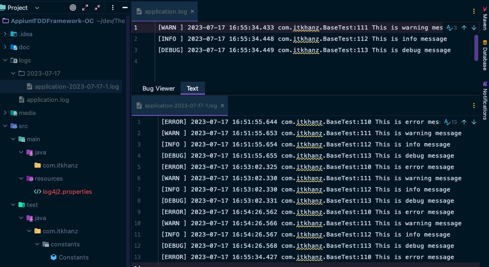

* Equivalent `log4j2.xml` file for above properties file will look like as below.
```xml
<?xml version="1.0" encoding="UTF-8"?>
<Configuration status="ERROR">
    <Appenders>
        <Console name="STDOUT" target="SYSTEM_OUT">
            <PatternLayout pattern="[%-5level] %d{yyyy-MM-dd HH:mm:ss.SSS} %c:%L - %m%n"/>
        </Console>
            <RollingFile
                    name="ROLLINGFILE"
                    fileName="logs/application.log"
                    filePattern="logs/$${date:yyyy-MM-dd}/application-%d{yyyy-MM-dd}-%i.log">
                <PatternLayout>
                    <Pattern>[%-5level] %d{yyyy-MM-dd HH:mm:ss.SSS} %c:%L %m%n</Pattern>
                </PatternLayout>
                <Policies>
                    <TimeBasedTriggeringPolicy />
                    <SizeBasedTriggeringPolicy size="1KB" />
                </Policies>
                <DefaultRolloverStrategy max="5" />
            </RollingFile>
    </Appenders>
    <Loggers>
        <Logger name="com.itkhanz" level="debug" additivity="false">
            <AppenderRef ref="STDOUT"/>
            <AppenderRef ref="ROLLINGFILE"/>
        </Logger>
        <Root level="info">
            <AppenderRef ref="STDOUT"/>
        </Root>
    </Loggers>
</Configuration>
```

* Based on your preferences, you can either use `log4j2.properties` file or `log4j2.xml` file
* In order to use log4j in all the classes, you need to add `static Logger log = LogManager.getLogger(CLASS.getName());` in all the classes.
* Another ways is to create a common method in `TestUtils` class:
```java
    public Logger log() {
		return LogManager.getLogger(Thread.currentThread().getStackTrace()[2].getClassName());
	}
```
* Update all the `testUtils.log()` statements with `testUtils.log().info()`
* Notice that currently log file name is not dynamic, and it will not support parallel execution also.
* We would ideally want to create the log file name dynamically based on the device properties from the test.

### Log4j2 - Logging in multi-threaded environment (parallel execution)
* In this section we will look at:
  * Output logs to separate files in case of parallel execution. We will generate
    one log file for each device. The log file name and directory structure will be
    generated at run time based on the device parameters just like the way we did
    for screenshots and videos.
* Dynamic file path or file name for logs file
* Output logs to separate file for each thread.
* Routing adapter and ThreadContext
* [RoutingAppender](https://logging.apache.org/log4j/2.x/manual/appenders.html#RoutingAppender)
* Replace the Rolling appender lines to following in `log4j2.properties` file:
```properties
#log4j
status = error
dest = err
name = PropertiesConfig

#console appender
appender.console.type = Console
appender.console.name = STDOUT
appender.console.layout.type = PatternLayout
appender.console.layout.pattern = [%-5level] %d{yyyy-MM-dd HH:mm:ss.SSS} %c:%L %m%n

# Rolling appender
appender.routing.type = Routing
appender.routing.name = MyRoutingAppender
appender.routing.routes.type = Routes
appender.routing.routes.pattern = $${ctx:ROUTINGKEY}
appender.routing.routes.route.type = Route

appender.routing.routes.route.rolling.type = RollingFile
appender.routing.routes.route.rolling.name = ROLLINGFILE
appender.routing.routes.route.rolling.fileName = ${ctx:ROUTINGKEY}/application.log
appender.routing.routes.route.rolling.filePattern = ${ctx:ROUTINGKEY}/$${date:yyyy-MM-dd}/application-%d{yyyy-MM-dd}-%i.log
appender.routing.routes.route.rolling.layout.type = PatternLayout
appender.routing.routes.route.rolling.layout.pattern = [${ctx:ROUTINGKEY} %-5level] %d{yyyy-MM-dd HH:mm:ss.SSS} %c:%L %m%n
appender.routing.routes.route.rolling.policies.type = Policies
appender.routing.routes.route.rolling.policies.time.type = TimeBasedTriggeringPolicy
appender.routing.routes.route.rolling.policies.size.type = SizeBasedTriggeringPolicy
appender.routing.routes.route.rolling.policies.size.size=1KB
appender.routing.routes.route.rolling.strategy.type = DefaultRolloverStrategy
appender.routing.routes.route.rolling.strategy.max = 10

#logger
logger.app.name = com.itkhanz
logger.app.level = debug
logger.app.additivity = false
logger.app.appenderRef.console.ref = STDOUT
logger.app.appenderRef.file.ref = MyRoutingAppender

#rootLogger
rootLogger.level = info
rootLogger.appenderRef.stdout.ref = STDOUT

```
* The value for the `ROUTINGKEY` can be assigned at runtime using ThreadContext class from log4j.
* We replaced the fileName and filePattern `logs/` parent folder to `${ctx:ROUTINGKEY}/`, so depending on the value of ROUTINGKEY variable, the file path will be set accordingly.
* We changed the rolling file appender to use the routing appender.
* Also in the logger, we change the reference from rolling file appender to routing appender.
* Now in the code, we need to assign the ROUTINGKEY value using ThreadContext class. We added this snippet in BaseTest
  class, since this is the starting point for our test executions. This value will be different for each thread.
* This means that the value for ROUTINGKEY will be substituted at the run time, and the routing appender will use that value to define the file path for rolling file appender.
* ROUTINGKEY is just a variable and could be any name. Be sure to use the same name throughout.

```java
        String strFile = "logs" + File.separator + platformName + "_" + deviceName;
        File logFile = new File(strFile);
        if (!logFile.exists()) {
            logFile.mkdirs();
        }
        //route logs to separate file for each thread
        ThreadContext.put("ROUTINGKEY", strFile);
        testUtils.log().info("log path: " + strFile);
```
* We can use the same configurations with `log4j2xml`:
```xml
<?xml version="1.0" encoding="UTF-8"?>
<Configuration status="ERROR">
  <Appenders>
    <Console name="STDOUT" target="SYSTEM_OUT">
      <PatternLayout pattern="[%-5level] %d{yyyy-MM-dd HH:mm:ss.SSS} %c:%L - %m%n"/>
    </Console>
    <Routing name="MyRoutingAppender">
      <Routes pattern="$${ctx:ROUTINGKEY}">
        <Route>
    		<RollingFile
    			name="appender-${ctx:ROUTINGKEY}"
    			fileName="${ctx:ROUTINGKEY}/application.log"
    			filePattern="${ctx:ROUTINGKEY}/$${date:yyyy-MM-dd}/application-%d{yyyy-MM-dd}-%i.log">
    			<PatternLayout>
        			<Pattern>[${ctx:ROUTINGKEY} %-5level] %d{yyyy-MM-dd HH:mm:ss.SSS} %c{1}:%L - %m%n</Pattern>
    			</PatternLayout>
    			<Policies>
        			<TimeBasedTriggeringPolicy />
        			<SizeBasedTriggeringPolicy size="10MB" />
    			</Policies>
    			<DefaultRolloverStrategy max="5" />
			</RollingFile>
        </Route>
      </Routes>
    </Routing>
  </Appenders>
  <Loggers>
    <Logger name="com.itkhanz" level="debug" additivity="false">
      <AppenderRef ref="STDOUT"/>
      <AppenderRef ref="MyRoutingAppender"/>
    </Logger>
    <Root level="info">
      <AppenderRef ref="STDOUT"/>
    </Root>
  </Loggers>
</Configuration>
```

> Important! The name of the package in `<Logger name ="PACKAGE">` must be same as in your project

* In case of web automation, we can replace the device name with browser name.

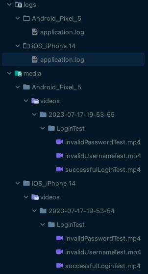

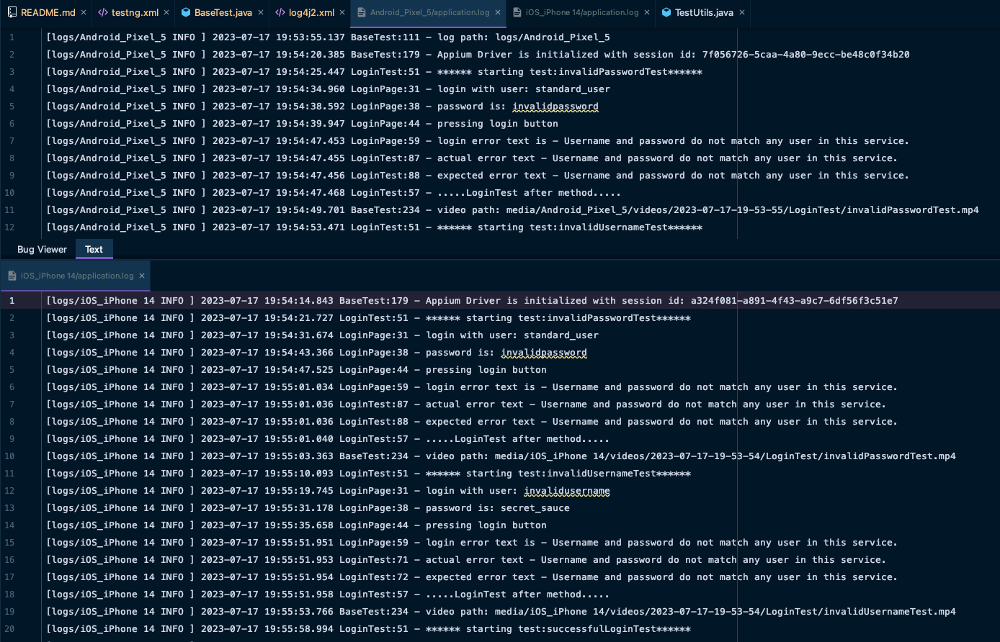

#### Use SLF4J with Log4J2

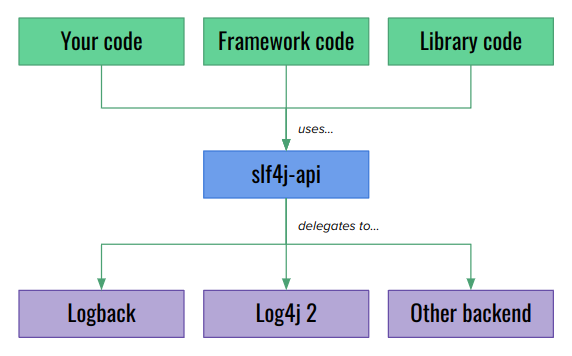

* Reading resources:
  * [Log4j2 with SLF4J Configuration - HowToDoInJava](https://howtodoinjava.com/log4j2/log4j2-with-slf4j/)
  * [SLF4j Vs Log4j – Which One is Better? - HowToDoInJava](https://howtodoinjava.com/log4j2/slf4j-vs-log4j-which-one-is-better/)
  * [SLF4J - Baeldung](https://www.baeldung.com/tag/slf4j)
  * [SLF4J - sematext](https://sematext.com/blog/slf4j-tutorial/)
  * [MDC](https://www.slf4j.org/api/org/slf4j/MDC.html)
  * [Apache Log4j2 SLF4J Binding](https://logging.apache.org/log4j/2.x/log4j-slf4j-impl.html)
  * [Can we use all features of log4j2 if we use it along with slf4j api?](https://stackoverflow.com/questions/41633278/can-we-use-all-features-of-log4j2-if-we-use-it-along-with-slf4j-api)
  * [What is the difference between ThreadContext.put() and MDC.Put()?](https://stackoverflow.com/questions/59540355/what-is-the-difference-between-threadcontext-put-and-mdc-put)
  * [Is it worth to use slf4j with log4j2](https://stackoverflow.com/questions/41498021/is-it-worth-to-use-slf4j-with-log4j2)
  * [SLF4J Vs Log4j](https://www.tutorialspoint.com/slf4j/slf4j_vs_log4j.htm)
* Currently we are using Log4J2 as our logging framework in this way with `log4j2.xml` configuration at src/main/resources:

* In TestUtils.java class: 
```java
import org.apache.logging.log4j.LogManager;
import org.apache.logging.log4j.Logger;

public class TestUtils {
  public Logger log() {
    return LogManager.getLogger(Thread.currentThread().getStackTrace()[2].getClassName());
  }
}
```
* In BaseTest.java class

```java
import org.apache.logging.log4j.ThreadContext;
import org.testng.annotations.BeforeTest;

public class BaseTest {
    
  @BeforeTest
  public void setup() {
    ThreadContext.put("ROUTINGKEY",strFile);
  }
}

```

* [Log4j 2 SLF4J Binding] (https://logging.apache.org/log4j/2.x/log4j-slf4j-impl.html)
* The Log4j 2 SLF4J Binding allows applications coded to the SLF4J API to use Log4j 2 as the implementation.
  * `log4j-slf4j2-impl` should be used with SLF4J 2.0.x releases or newer.
* Simple Logging Facade for Java (abbreviated SLF4J) acts as a facade for different logging frameworks (e.g., java.util.logging, logback, Log4j). It offers a generic API, making the logging independent of the actual implementation.
* This allows for different logging frameworks to coexist. And it helps migrate from one framework to another. Finally, apart from standardized API, it also offers some “syntactic sugar.”
* To use SLF4J with Log4j 2, we add the following libraries to pom.xml:
```xml
<dependency>
    <groupId>org.apache.logging.log4j</groupId>
    <artifactId>log4j-api</artifactId>
    <version>2.7</version>
</dependency>
<dependency>
    <groupId>org.apache.logging.log4j</groupId>
    <artifactId>log4j-core</artifactId>
    <version>2.7</version>
</dependency>
<dependency>
    <groupId>org.apache.logging.log4j</groupId>
    <artifactId>log4j-slf4j2-impl</artifactId>
    <version>2.7</version>
</dependency>
```

* For usage, we replace `LogManager` with `LoggerFactory` to call getLogger.
* In TestUtils.java class:
```java
import org.slf4j.Logger;
import org.slf4j.LoggerFactory;

public class TestUtils {
  public Logger log() {
    return LoggerFactory.getLogger(Thread.currentThread().getStackTrace()[2].getClassName());
  }
}
```
* In BaseTest.java class, we use `MDC` instead of `ThreadContext`
```java
import org.slf4j.MDC;

public class BaseTest {
    
  @BeforeTest
  public void setup() {
    MDC.put("ROUTINGKEY", strFile);
  }
}
```
* All the configurations of `log4j2.xml` remain same.

> With the integration of SLF4J,  you no longer get this annoying warning in IntelliJ: `SLF4J: No SLF4J providers were found. SLF4J: Defaulting to no-operation (NOP) logger implementation`

---

### Start Appium server programmatically

* If you want to run the appium tests as part of CI/CD pipeline, then appium server should start and stop
  programmatically.
* Otherwise you have to start it manually and make sure its running.
* We will
  use [AppiumServiceBuilder](https://javadoc.io/static/io.appium/java-client/8.5.1/io/appium/java_client/service/local/AppiumServiceBuilder.html)
  and [AppiumDriverLocalService](https://javadoc.io/doc/io.appium/java-client/latest/io/appium/java_client/service/local/AppiumDriverLocalService.html)
* If using TestNG, start the Appium server under `@BeforeSuite` annotation or `@AfterSuite` annotation:
  * If running `tests` in parallel using **Single Appium Server Instance**, then start under `@BeforeSuite`
  * If running `tests` in parallel using **Separate Appium Server Instance** for each thread (i.e. each mobile device),
    then start under `@BeforeTest` using different port number.
* We will also check if appium server is already running (using `AppiumDriverLocalService.isRunning()` or by checking if
  port is already in use)
* Command to free port on Mac:
  `lsof -P | grep ':4723' | awk '{print $2}' | xargs kill -9`
* https://stackoverflow.com/questions/3855127/find-and-kill-process-locking-port-3000-on-mac
* Path to usingDriverExecutable() can be found by `where node` on Mac
* Run the command `where appium` to find the appium executable shortcut path on Mac.
* Path to withAppiumJS() can be found by right-clicking the appium binary shortcut at above location and then show
  original.
* If you are running the tests from intellij, then it will not read the path of system environment and path variables. so we need to add them manually.
* Make sure you have environment variables set. Below is a sample for my `.~zshrc`:
```text
export JAVA_HOME=/Library/Java/JavaVirtualMachines/jdk-17.0.2.jdk/Contents/Home
export PATH=$PATH:$JAVA_HOME/bin

export MAVEN_HOME=/Library/Maven/apache-maven-3.9.2
export PATH=$PATH:$MAVEN_HOME/bin
eval "$(/usr/local/bin/brew shellenv)"

export NVM_DIR="$HOME/.nvm"
[ -s "$NVM_DIR/nvm.sh" ] && \. "$NVM_DIR/nvm.sh"  # This loads nvm
[ -s "$NVM_DIR/bash_completion" ] && \. "$NVM_DIR/bash_completion"  # This loads nvm bash_completion

export ANDROID_HOME=${HOME}/Library/Android/sdk
export PATH=$PATH:$ANDROID_HOME/platform-tools
export PATH=$PATH:$ANDROID_HOME/cmdline-tools
```
* Path to JDK, Android SDK, platform-tools, cmdline-tools should be set in environment variables.
* run the command `echo $PATH` to get the path variables
* if you get an
  error `AppiumServerHasNotBeenStartedLocallyException: [The local appium server has not been started, Reason: Timed out waiting for [http://http/127.0.0.1:4723/status] to be available after 20003 ms, Consider increasing the server startup timeout value (currently 20000ms), Node.js executable path: /Users/ibkh/.nvm/versions/node/v18.16.0/bin/node,`,
  then increase the server timeout property.
* Even though `ANDROID_HOME` environment variable is set, but IntelliJ does not locate it, so if you get an
  error like `[Appium] spawn npm ENOENT`
  or `org.openqa.selenium.SessionNotCreatedException: Could not start a new session. Response code 500. Message: An unknown server-side error occurred while processing the command. Original error: Neither ANDROID_HOME nor ANDROID_SDK_ROOT environment variable was exported.`,
  then add the the path to ANDROID_HOME. This can be found by opening Android Studio -> SDK Manager and copy the path
  in `Android SDK Location` field, and add it also to the environment variable.
* If you get an error
  like `[Xcode] Cannot determine the path to Xcode by running 'xcode-select -p' command. Original error: 'xcode-select' executable is not found`
  or `simulator with UDID not found`, this is because IntelliJ cannot determine the path to XCode Commandline tools so
  you have to add them manually. You can find the installation path of Xcode by running `xcode-select -p` and of
  xcode-select by running `where xcode-select` then add the path to your appium service builder.
* Alternatively you an skip providing the environment variables for appium server, and instead run the tests through maven surefire plugin which will automatically load the environment variables.
* This is how the appium server logs will be captured in `server.log`. Logs for suite are captured separately in server/datetime/application.log

* 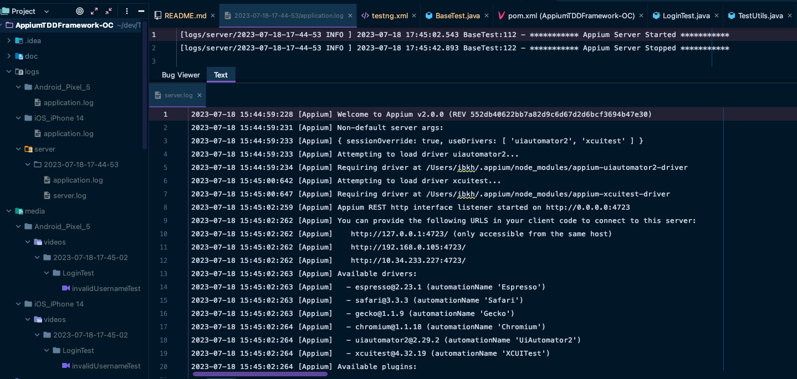

---

### Extent Reports integration

* [Extent Reports](https://www.extentreports.com/)
* [Extent Reports v5 Docs- Java](https://www.extentreports.com/docs/versions/5/java/index.html)
* [extentreports-java - GitHub](https://github.com/extent-framework/extentreports-java)
* [extentreports-java-v5 - GitHub Wiki](https://github.com/extent-framework/extentreports-java/wiki)
* [Extent Spark Reporter Sample](https://github.com/extent-framework/extentreports-java)
* [ExtentReports 5.x tutorial series by Testing Mini Bytes / Amuthan Sakthivel](https://www.youtube.com/playlist?list=PL9ok7C7Yn9A-yUEnE62gOQ2B4pL3gsC28)
* [ExtentReports » 5.0.9 --> Vulnerabilities from dependencies](https://github.com/extent-framework/extentreports-java/issues/376)
* [Updated to selenium 4.9.0- now working extent report broke](https://github.com/extent-framework/extentreports-java/issues/382)
* [Extent Reports in Selenium with TestNG](https://www.swtestacademy.com/extent-reports-in-selenium-with-testng/)
* []()

> Extent Reports is not being maintained actively any more so it is suggested to use other reporting libraries.


* Using Extent API, we will:
  * leverage TestNG iTestListener
  * capture logs for each step
  * capture screenshot using filepath and base64 string.
  * support parallel execution
  * assign tags and devices to categorize and identify test cases for each device.
  * assign authors (for ownership)

* Add the maven dependency to POM.xml
```xml
<!-- https://mvnrepository.com/artifact/com.aventstack/extentreports -->
<dependency>
    <groupId>com.aventstack</groupId>
    <artifactId>extentreports</artifactId>
    <version>5.0.9</version>
</dependency>
```

* All methods on ExtentReports are multi-thread safe. The recommended usage is to maintain a single instance of
  ExtentReports object for your test session.
* Add the following lines of code in a newly created ExtentReport class. The recommended usage is to maintain a single
  instance of ExtentReports object for your test session. Therefore, we created a custom synchronized method to check if
  the instance already exists.
* Tests are created
  using [ExtentReports::createTest](https://www.extentreports.com/docs/versions/5/java/index.html#create-tests). The
  createTest method returns a ExtentTest object which can be used
  to publish logs, create nodes, assign attributes (tags, devices, authors) or attach screenshots.

```java
import com.aventstack.extentreports.ExtentReports;
import com.aventstack.extentreports.ExtentTest;
import com.aventstack.extentreports.reporter.ExtentSparkReporter;
import com.aventstack.extentreports.reporter.configuration.Theme;

import java.util.HashMap;
import java.util.Map;

public class ExtentManager {
    static ExtentReports extentReports;
    final static String reportFilePath = "Extent.html";
    static Map<Long, ExtentTest> extentTestMap = new HashMap<>();

    public synchronized static ExtentReports getReporter() {
        if (extentReports == null) {
            ExtentSparkReporter spark = new ExtentSparkReporter(reportFilePath);
            spark.config().setDocumentTitle("Appium TDD Framework");
            spark.config().setReportName("Sauce Labs Demo App");
            spark.config().setTheme(Theme.DARK);
            extentReports = new ExtentReports();
            extentReports.attachReporter(spark);
        }
        return extentReports;
    }

    public static ExtentTest getTest() {
        return extentTestMap.get(Thread.currentThread().getId());
    }

    public static synchronized ExtentTest startTest(String testName, String desc) {
        ExtentTest extentTest = getReporter().createTest(testName, desc);
        extentTestMap.put(Thread.currentThread().getId(), extentTest);
        return extentTest;
    }

}
```

* We will call these methods from the iTestListener.
* [Extent Report Logging](https://www.extentreports.com/docs/versions/5/java/index.html#logging)
* It is possible to create log with text details, Exception/Throwable, ScreenCapture or custom Markup using MarkupHelper.
* After all the test method are executed, we need to flush the reporter which basically writes all the information to report.
* The line `extent.flush()` instructs ExtentReports write the test information to a destination.

```java
import com.aventstack.extentreports.Status;

public class TestListener implements ITestListener {
  TestUtils testUtils = new TestUtils();

  @Override
  public void onStart(ITestContext context) {
    ITestListener.super.onStart(context);
  }

  @Override
  public void onFinish(ITestContext context) {
    ExtentManager.getReporter().flush();
  }

  @Override
  public void onTestStart(ITestResult result) {
    ITestListener.super.onTestStart(result);
  }

  @Override
  public void onTestSuccess(ITestResult result) {
    ExtentManager.getTest().log(Status.PASS, "Test Passed");
  }

  @Override
  public void onTestSkipped(ITestResult result) {
    ExtentManager.getTest().log(Status.SKIP, "Test Skipped");
  }

  @Override
  public void onTestFailure(ITestResult result) {
      //code to capture and attach screenshot
    ExtentManager.getTest().log(Status.FAIL,"Test Failed");
  }
}
```

* In the BaseTest class, add the code to start the extent report. Here we will leverage the java.lang.reflect.Method
  instead of TestNG ITestResult to get the method name and description.
* We called this method in BaseTest Class, because we are setting the platform and deviceName in the BeforeTest method
  in this class, so these variables are not available in the listener onTestStart method because it executes first.

```java
@BeforeMethod
    public void beforeMethodBase(Method method) {
        ExtentManager.startTest(method.getName(), method.getAnnotation(Test.class).description())
                .assignCategory(getPlatform() + "_" + getDevice())
                .assignAuthor("itkhanz")
                ;

        //testUtils.log().info(".....super before method.....");
        ((CanRecordScreen) getDriver()).startRecordingScreen();
    }
```

* The `Extent.html` report will be generated at the root location

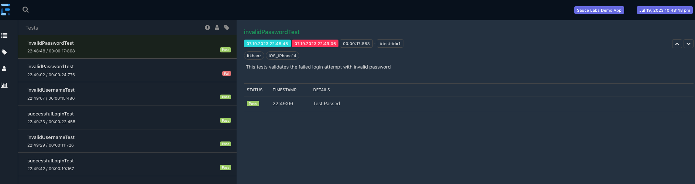

* Ideally test case logging should only be to get the UI actions or any validations.
* We can put the extent report logging statements inside the page objects to avoid putting them all over in test methods
  repeatedly.
* The methods in page objects already contain logging statements for log4j, so to avoid the duplication, we will put
  these logging statements in our generic action methods.
* We overloaded the action methods to accept the message string as additional argument.
* [System Info](https://www.extentreports.com/docs/versions/5/java/index.html#system-info) allows to add system or environment info for your using using the setSystemInfo method. This automatically adds system information to all started reporters.
* [how to get property value from pom.xml?](https://stackoverflow.com/a/52465584/7673215)
* [Retrieve version from maven pom.xml in code](https://stackoverflow.com/a/3697482/7673215)
* [maven resource plugin](https://maven.apache.org/plugins/maven-resources-plugin/examples/filter.html)
* we defined the `project.properties` at class path `src/main/resources`:
```properties
java-version=${java.release.version}
appium-version=${appium-java-client-version}
testng-version=${testng.version}
extentreports-version=${extentreports.version}
owner=itkhanz
```
* and enabled the resouece filtering in pom.xml:
```xml
<build>
  <resources>
    <resource>
      <directory>src/main/resources</directory>
      <filtering>true</filtering>
    </resource>
  </resources>   
</build>
```
* and in the code inside BaseTest class in beforesuite method:
```java
        ExtentManager.getReporter().setSystemInfo("OS", System.getProperty("os.name"));
        Properties projectProps = new Properties();
        try {
            projectProps.load(getClass().getClassLoader().getResourceAsStream("project.properties"));
            ExtentManager.getReporter().setSystemInfo("JDK", projectProps.getProperty("java-version"));
            ExtentManager.getReporter().setSystemInfo("Appium", projectProps.getProperty("appium-version"));
            ExtentManager.getReporter().setSystemInfo("TestNG", projectProps.getProperty("testng-version"));
            ExtentManager.getReporter().setSystemInfo("ExtentReport", projectProps.getProperty("extentreports-version"));
            ExtentManager.getReporter().setSystemInfo("owner", projectProps.getProperty("owner"));
        } catch (IOException e) {
            testUtils.log().info("failed to load project.properties");
        }
```

* This outputs the environment variables in report dashboard as:

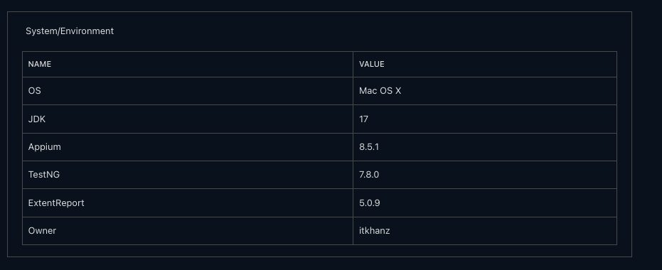

* Use base64 screenshots that will make the screenshots embed in the report unlike the file format in which report
  attaches the screenshot with img tag.
* This will help to send the report as Email with embedded images.
* We will convert our file to byte array and then to String base64 string to pass to MediaEntityBuilder method.
* The disadvantage is that, this will increase the report size substantially i.e. approx 1MB for each image. But On
  verifying with 2 screenshots attached, report size was still below 1 MB.

```java
// reference image saved to disk
test.fail(MediaEntityBuilder.createScreenCaptureFromPath("img.png").build());

// base64
test.fail(MediaEntityBuilder.createScreenCaptureFromBase64String("base64").build());
```

* Intentionally failed the test to see the output of attached screenshot and stacktrace in output:
* Here is how the report looks like after a full test run:

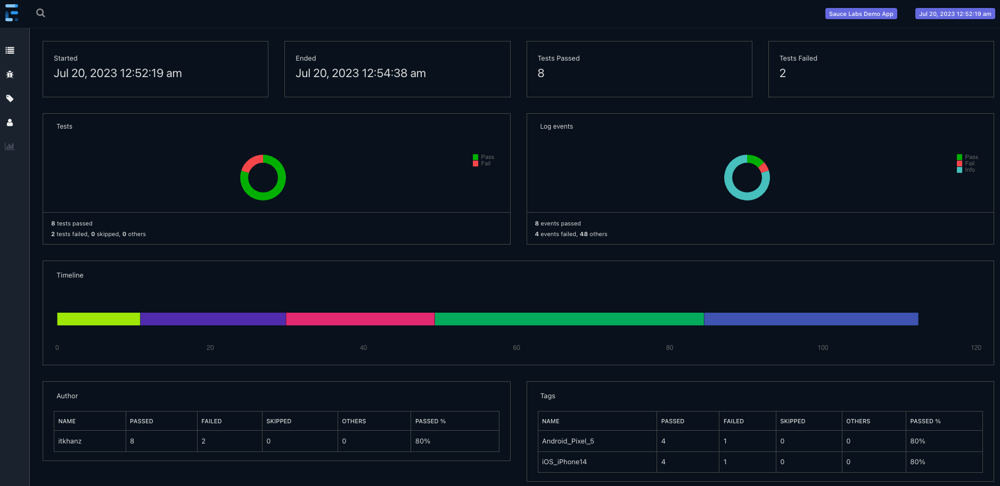

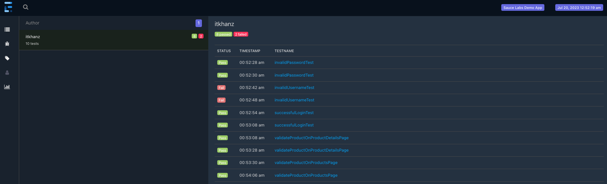

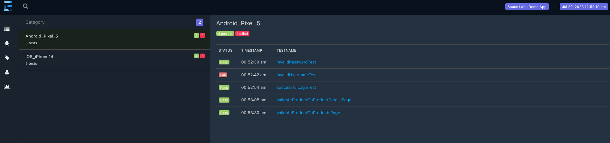

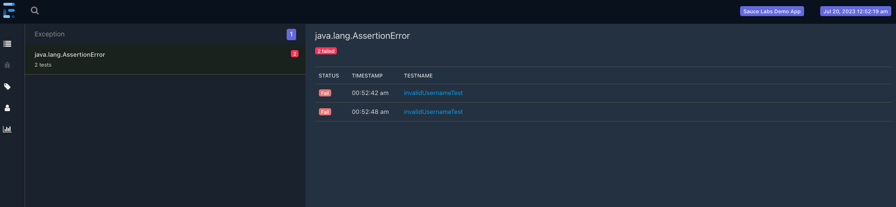

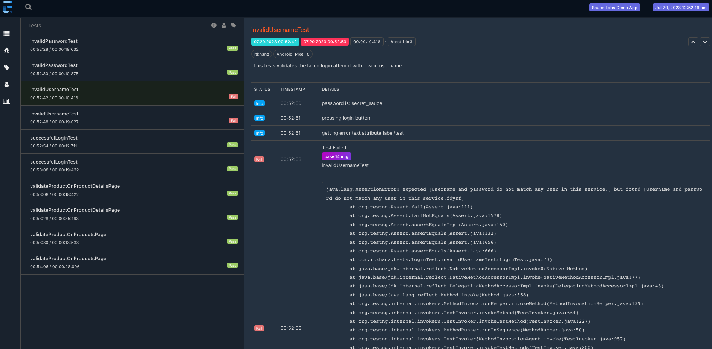

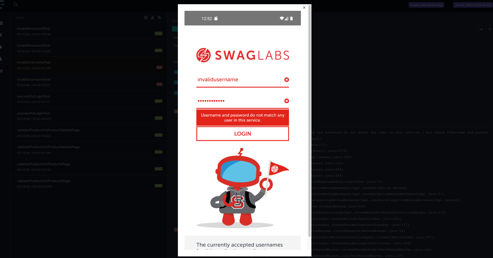

---

## Deep Links

* [https://www.headspin.io/blog/speeding-up-tests-with-deep-links](https://www.headspin.io/blog/speeding-up-tests-with-deep-links)
* [Reliably Opening Deep Links Across Platforms and Devices](https://www.headspin.io/blog/reliably-opening-deep-links-across-platforms-and-devices)
* Since we need to be on the login page in each test case, and we are executing tests from the same driver session.
  Therefore we are performing logout after each test, so the next test starts from the login screen. This is an extra
  step that slows down the automation.
* If the logout step fails due to same reason, then the next tests automatically fail causing flakiness.
* Alternative is to call terminate app and activate app operations before each method but this will also cause significant overhead.
* The intent of the test is to perform specific validations on page, and the setup steps to login and navigate to that
  page are unnecessary overhead conflicting with the intent of test case.
* This problem can be solved by deep links which enable us to navigate and perform certain actions without UI actions.
* [Sauce Labs Sample App Deep linking](https://github.com/saucelabs/sample-app-mobile#deep-linking)
  * On Android, running following command will open the checkout screen with 2 products in cart:
    * `adb shell am start -W -a android.intent.action.VIEW -d "swaglabs://checkout-overview/1,2"`
    * We do not have access to the adb commands during cloud execution because of the security issues.
  * On iOS, we can run the following command, and accept the alert to open the products overview page with 2 products already in the cart:
    * `xcrun simctl openurl booted swaglabs://swag-overview/0,1`
  * We can also open the safari and type the following:
    * `swaglabs://swag-overview/0,1`

* [Android Deep linking](https://github.com/appium/appium-uiautomator2-driver#mobile-deeplink)

---

## CI/CD with Jenkins

* Create separate suite for android and iOS.
* Add variable for test suite in pom.xml:
```xml
<properties>
  <maven.surefire.version>3.1.2</maven.surefire.version>
  <testSuite>${testSuite}</testSuite>
</properties>

<build>
  <pluginManagement>
      <plugins>
          <plugin>
              <groupId>org.apache.maven.plugins</groupId>
              <artifactId>maven-surefire-plugin</artifactId>
              <version>${maven.surefire.version}</version>
              <configuration>
                  <suiteXmlFiles>
                      <suiteXmlFile>${testSuite}</suiteXmlFile>
                  </suiteXmlFiles>
              </configuration>
          </plugin>
      </plugins>
  </pluginManagement>
</build>
```
* Run tests with:
  * `mvn clean test -D"testSuite=android.xml"`
  * `mvn clean test -D"testSuite=ios.xml"`
  
* Or you can add both suiteXmLFiles as:
```xml
<pluginManagement>
            <plugins>
                <plugin>
                    <groupId>org.apache.maven.plugins</groupId>
                    <artifactId>maven-surefire-plugin</artifactId>
                    <version>${maven.surefire.version}</version>
                    <configuration>
                        <suiteXmlFiles>
                            <suiteXmlFile>android.xml</suiteXmlFile>
                            <suiteXmlFile>ios.xml</suiteXmlFile>
                        </suiteXmlFiles>
                    </configuration>
                </plugin>
            </plugins>
        </pluginManagement>
```
* and then run tests with:
  * `mvn clean test` for both iOS and Android
  * `mvn clean test -D"surefire.suiteXmlFiles=android.xml"`
  * `mvn clean test -D"surefire.suiteXmlFiles=ios.xml"`
* If you get lombok related error, make sure you have enabled the annotation processing and then add the latest lombok
  version into your project.
  `[ERROR] Failed to execute goal org.apache.maven.plugins:maven-compiler-plugin:3.10.1:testCompile (default-testCompile) on project AppiumTDDFramework-OC: Fatal error compiling: java.lang.IllegalAccessError: class lombok.javac.apt.LombokProcessor (in unnamed module @0x1152900) cannot access class com.sun.tools.javac.processing.JavacProcessingEnvironment (in module jdk.compiler) because module jdk.compiler does not export com.sun.tools.javac.processing to unnamed module @0x1152900 -> [Help 1]
  `
* Fork and Clone the Sauce Labs Demo App https://github.com/saucelabs/sample-app-mobile
  * We are forking and cloning the repository so that we can pull the latest app code to jenkins and do the commits as
    well. We are doing this to mimic the build generation process as much as possible by avoiding the complex process of
    building the app.

### Mac: Install and Configure Jenkins

* [macOS Installers for Jenkins LTS](https://www.jenkins.io/download/lts/macos/)
* Install the latest LTS version: `brew install jenkins-lts`
* Start the Jenkins service: `brew services start jenkins-lts`
* Stop the Jenkins service: `brew services stop jenkins-lts`
* Restart the Jenkins service: `brew services restart jenkins-lts`
* Launch http://localhost:8080
* Unlock Jenkins:
  * Admin Password: /Users/****/.jenkins/secrets/initialAdminPassword
* Install the suggested plugins
* Create First Admin User and login
* Specify the Jenkins URL e.g. `http://localhost:8080/`

### Jenkins: Create Android test job

* create a freestyle job and add Git repo and branch
* Choose the `Build Step` and `Execute Shell` command:
* The path to maven should be same as in your system.
```shell
#!/bin/zsh -l
export MAVEN_HOME=/Library/Maven/apache-maven-3.9.2
export PATH=$PATH:$MAVEN_HOME/bin
mvn --version
mvn clean test -D"surefire.suiteXmlFiles=android.xml"
```
* This will run tests provided that the emulator is already running on System.

* [Jenkins Maven Configuration](https://toolsqa.com/jenkins/jenkins-maven/)
* Also install following plugins:
  * [TestNG Results](https://plugins.jenkins.io/testng-plugin/)
  * [HTML Publisher](https://plugins.jenkins.io/htmlpublisher/)
  * [Email Extension](https://plugins.jenkins.io/email-ext/)
  * [Email Extension Template](https://plugins.jenkins.io/emailext-template/)
* Alternatively, you can configure the JAVA_HOME and MAVEN_HOME as specified in the steps in above link.
* We will also publish the TestNG reports with [TestNG Results Plugin](https://www.lambdatest.com/blog/how-to-generate-testng-reports-in-jenkins/)
* Create a new Maven Project:
  * Choose `This project is parameterized` and add parameters for platfom suites
  * Add Git repo, credentials, and branch.
  * Specify the Goal in Build `clean test -Dsurefire.suiteXmlFiles="$platform".xml`
  * [How To Generate TestNG Reports In Jenkins?](https://www.lambdatest.com/blog/how-to-generate-testng-reports-in-jenkins/)
  * [JENKINS - Publish Extent Report](https://www.youtube.com/watch?v=zn0cLQnaKXY)
  * [How To Publish ExtentReport Using Jenkins](https://automationqahub.com/how-to-publish-extentreport-using-jenkins/)
  * In Post-build actions:
    * choose `Publish TestG Results`, and specify the path to testng-results.html
    * choose `Publish HTML reports` and specify the path of extent report folder and index page.

* If the Extent Report is broken, [run this script](https://stackoverflow.com/a/51780073/7673215) 
  * Install [Groovy plugin](https://plugins.jenkins.io/groovy)
  * Reach to your job --> Configure--> Pre Steps --> Execute it in an "Execute system Groovy Script" build step with this script:-
  ```groovy
  System.clearProperty("hudson.model.DirectoryBrowserSupport.CSP");
  
  System.setProperty("hudson.model.DirectoryBrowserSupport.CSP", "sandbox allow-same- origin allow-scripts;default-src *; script-src 'self' 'unsafe-inline' 'unsafe-eval' *; style-src  'self' 'unsafe-inline' *; connect-src * 'self' data:; img-src 'self' data:;");
  ```
* Install the `Email Extension` and `Email Extension Template Plugin`.
  * Configure the sender and receiver email
  * You must use the app password for email and not the regular. APP password must be set both
    for `Extended E-mail Notification` and ` E-mail Notification`
  * Email configuration is explained in detail here:
    * [Framework - Jenkins Email Report] (https://github.com/itkhanz/REST-Assured-API-Testing/tree/main/RESTAssured-OC#framework---jenkins-email-report)
    * [How to Share TestNG Reports in Jenkins?](https://www.lambdatest.com/blog/how-to-generate-testng-reports-in-jenkins/#Jenkins)
    * Make sure that the build trigger is set to always in post build actions for email.
* Following subject was added to the `Default Content section` in `Editable Email Notification` in Post build actions.
* To attach the reports, following comma separated files are specified `**/extent.html, **/emailable-report.html`

```html
<!DOCTYPE html>
<html>
<head>
    <meta charset="utf-8">
    <meta name="viewport" content="width=device-width, initial-scale=1">
    <title></title>
</head>
<body>
<h4 style="font-size: 20px" class="value" align="left">${JOB_DESCRIPTION}</h4>
<div>Build Initiated by: <b>${BUILD_USER}</b></div>
<div>GIT Branch: <b>${GIT_BRANCH}</b></div>
<div>Test Platform: <b>${platform}</b></div>
<div>Tests Summary: <b>${FAILED_TESTS, showStack=false}</b></div>
<table class="container" align="center" style="padding-top: 20px;">
    <tr class="center">
        <td colspan="4">
            <h2>Appium TDD Automation Test Reports</h2>
        </td>
    </tr>
    <tr>
        <td>
            <table style="background: #67c2ef;width: 120px;">
                <tr>
                    <td style="font-size: 36px" class="value" align="center">${TEST_COUNTS, var="total"}</td>
                </tr>
                <tr>
                    <td style="center">Total</td>
                </tr>
            </table>
        </td>
        <td>
            <table style="background: #79c447;width: 120px;">
                <tr>
                    <td style="font-size: 36px" class="value" align="center">${TEST_COUNTS, var="pass"}</td>
                </tr>
                <tr>
                    <td style="center">Passed</td>
                </tr>
            </table>
        </td>
        <td>
            <table style="background: #ff5454;width: 120px;">
                <tr>
                    <td style="font-size: 36px" class="value" align="center">${TEST_COUNTS, var="fail"}</td>
                </tr>
                <tr>
                    <td style="center">Failed</td>
                </tr>
            </table>
        </td>
        <td>
            <table style="background: #fabb3d;width: 120px;">
                <tr>
                    <td style="font-size: 36px" class="value" align="center">${TEST_COUNTS, var="skip"}</td>
                </tr>
                <tr>
                    <td style="center">Skipped</td>
                </tr>
            </table>
        </td>
    </tr>
</table>
<div>Check console output at <a href="$BUILD_URL">BUILD URL</a> to view the results.</div>
</body>
</html>
```

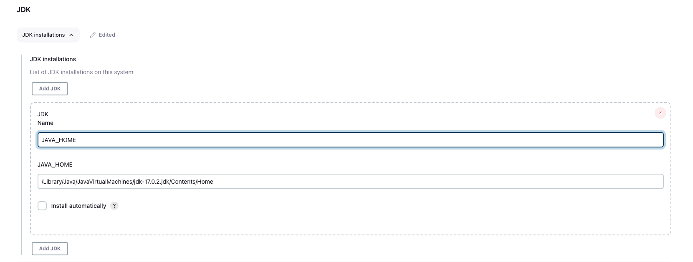

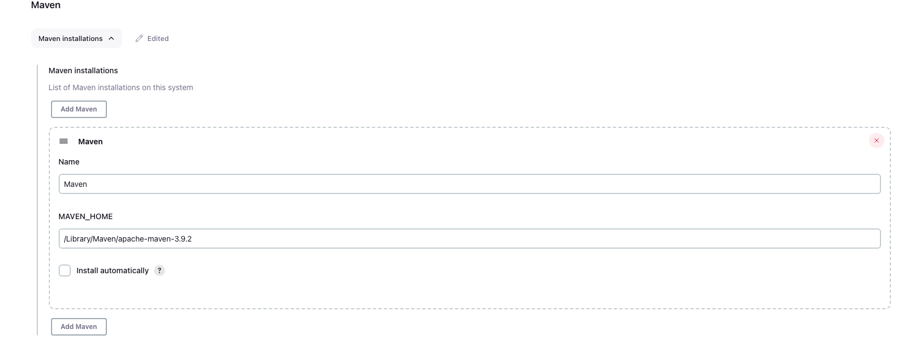

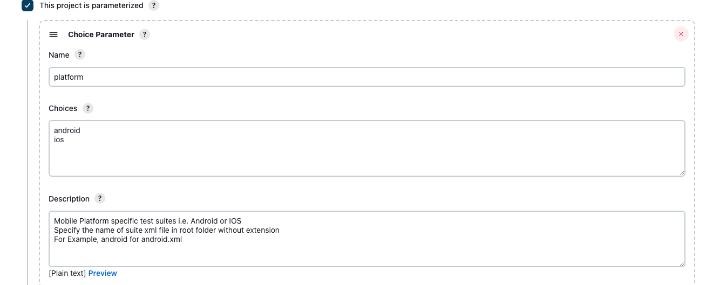

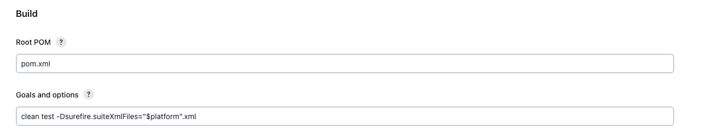

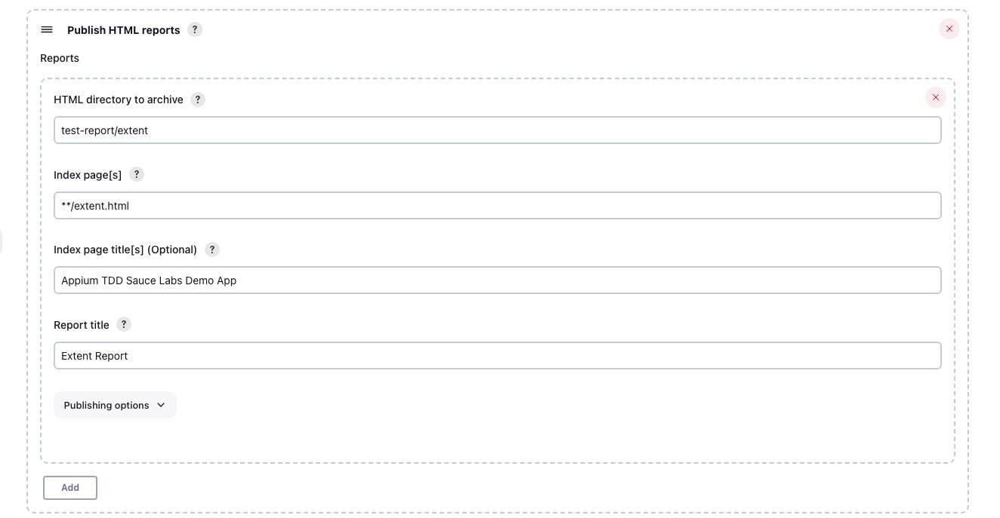

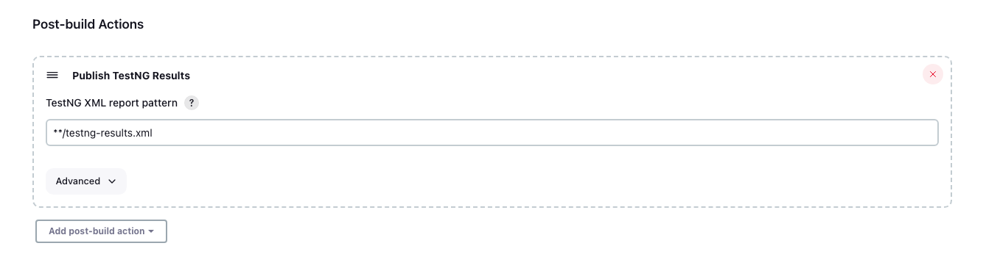

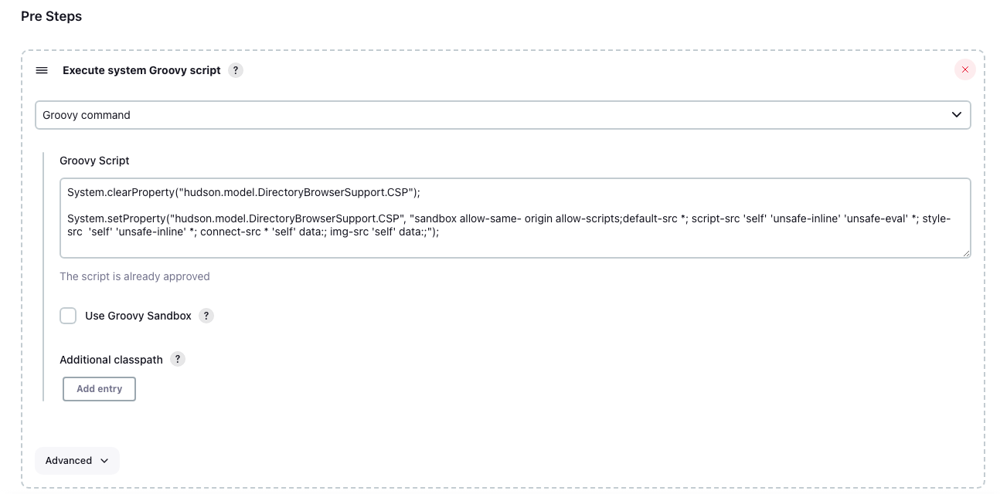

* After all the configuration, you can now now run the tests on either iOS or Android:


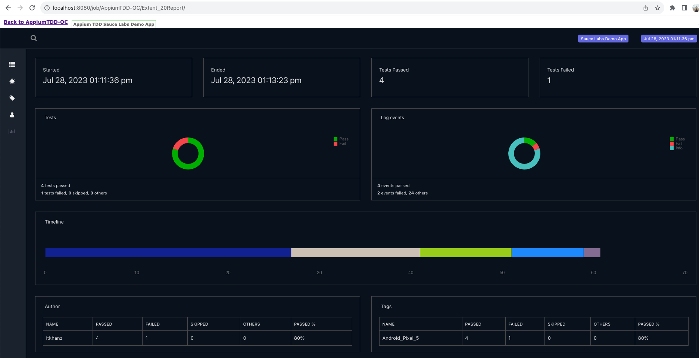

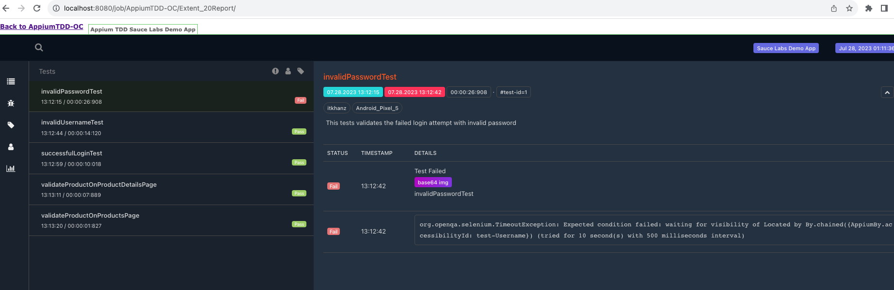

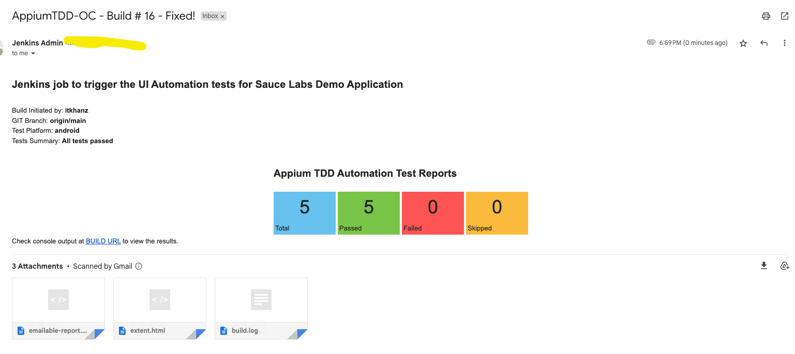

### Create Jenkins Pipeline Script

* Instead of creating the Maven Job in Jenkins manually by UI actions in Jenkins, a better approach is to perform these steps in a scripted manner.
* We can create a `Jenkinsfile` and write the script in it to replicate the above steps as separate build stages.
* Make sure that you have already set the maven path in jenkins, and the above mentioned plugins installed.
* To create a pipeline job:
  * Create New Item of type `Pipeline` in Jenkins.
  * Since we want to control the build for both android and iOS with a single job, so we choose
    the `This Project is parameterized` 
  
  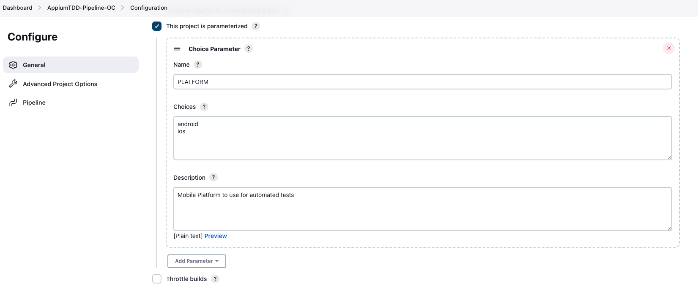  

  * Then in the `Pipeline` section, choose `Pipeline Script` as `Definition`
  * Add the following script in Script section:
    * You can click on the `Pipeline Syntax` link to generate pipeline script for your desired step. It will list all
      the possible steps for all your plugins also.
    * It configures the build tool as Maven whose executable path is configured in `Manage Jenkins > Tools > Maven`
    
    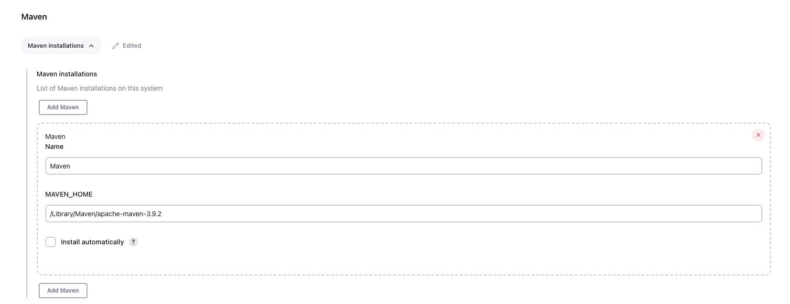

    * Checks out the git repo from specified url and branch. Make sure to replace the `credentialsId` with your own
      credentials ID. you can create the credentials ID at the time of adding new credentials in jenkins.
    * Compile Code
    * Run Tests based on chosen Platform
    * Archive the logs folder which contains the Appium Server and platform specific test logs. Choose the location of
      logs folder as per your project.
    * In the post build stages, we will:
      * Publish the TestNG Results. Make sure that your xml results are named by default as `testng-results.xml`
      * Publish the Extent HTML Report to view in Jenkins. Specify the `reportDir` and `reportFiles` according to your
        project.
      * Send email to after the build is finished which contains the build details, test results, link to view the test
        report directly, link to Jenkins job build. It also attaches the build log, custom appium logs, extent html
        report, and testng html report in email body.

```groovy
pipeline {
    agent any

    tools {
        // Install the Maven version configured as "Maven" and add it to the path.
        maven "Maven"
    }

    parameters {
        choice(name: 'PLATFORM', choices: ['android', 'ios'], description: 'Mobile Platform to use for automated tests')
    }

    stages {
        stage('Stage 1 - Checkout Code') {
            steps {
                // Get some code from a GitHub repository
                git ([
                        branch: 'main',
                        changelog: true,
                        credentialsId: 'PERSONAL_GIT_CREDENTIALS_ID',
                        poll: false,
                        url: 'https://github.com/itkhanz/AppiumTDDFramework-OC'
                ])

                echo 'Code is checked out'
            }
        }
        stage('Stage 2 - Compile Code') {
            steps {
                echo 'Compiling Code'
                sh "mvn compile"
            }
        }
        stage('Stage 3 - Run Tests') {
            steps {
                echo "Running tests for platform: ${params.PLATFORM}"
                sh "mvn clean test -Dsurefire.suiteXmlFiles='${params.PLATFORM}.xml'"
            }
        }
        stage('Stage 4 - Archive Logs') {
            steps {

                echo 'Archiving the appium server and test logs'
                // Zip the logs folder
                sh 'zip -r logs.zip logs'

                // Archive the zip file as a build artifact
                archiveArtifacts artifacts: 'logs.zip', fingerprint: true
            }
        }
    }

    post {

        always {
            //Publish TestNG Results
            echo 'Publishing the TestNG Results'
            testNG()

            //Publish the HTML report using the HTML Publisher plugin
            echo 'Publishing the Extent Report'
            publishHTML([
                    allowMissing: false,
                    alwaysLinkToLastBuild: false,
                    keepAll: false,
                    reportDir: 'test-report/extent',
                    reportFiles: '**/extent.html',
                    reportName: 'Extent Report',
                    reportTitles: 'Appium TDD Sauce Labs Demo App Test Report',
                    useWrapperFileDirectly: true
            ])

            // Send an email with the attached HTML report using the email-ext plugin
            echo 'Sending EMAIL using email-ext plugin'
            emailext ([
                    attachLog: true,
                    attachmentsPattern: '**/extent.html, **/emailable-report.html, logs.zip',
                    mimeType: 'text/html',
                    postsendScript: '$DEFAULT_POSTSEND_SCRIPT',
                    presendScript: '$DEFAULT_PRESEND_SCRIPT',
                    subject: '$DEFAULT_SUBJECT',
                    to: '$DEFAULT_RECIPIENTS',
                    body: '''<!DOCTYPE html>
                        <html>
                        <head>
                            <meta charset="utf-8">
                            <meta name="viewport" content="width=device-width, initial-scale=1">
                            <title></title>
                        </head>
                        <body>
                        <h4 style="font-size: 20px" class="value" align="left">${JOB_DESCRIPTION}</h4>
                        <div>Jenkins Job: <b>${JOB_NAME}</b></div>
                        <div>Build Initiated by: <b>${BUILD_USER}</b></div>
                        <div>GIT Branch: <b>${GIT_BRANCH}</b></div>
                        <div>Test Platform: <b>${PLATFORM}</b></div>
                        <div>Tests Summary: <b>${FAILED_TESTS, showStack=false}</b></div>
                        <div>Check Build details (incl. TestNG Results, Console Output) at <a href="$BUILD_URL">BUILD URL</a> to view the detailed results.</div>
                        <div>View the HTML report: <a href="${JENKINS_URL}job/${JOB_NAME}/Extent_20Report/">Extent Report</a></div>
                        <table class="container" align="center" style="padding-top: 20px;">
                            <tr class="center">
                                <td colspan="4">
                                    <h2>Appium TDD Automation Test Reports</h2>
                                </td>
                            </tr>
                            <tr>
                                <td>
                                    <table style="background: #67c2ef;width: 120px;">
                                        <tr>
                                            <td style="font-size: 36px" class="value" align="center">${TEST_COUNTS, var="total"}</td>
                                        </tr>
                                        <tr>
                                            <td style="center">Total</td>
                                        </tr>
                                    </table>
                                </td>
                                <td>
                                    <table style="background: #79c447;width: 120px;">
                                        <tr>
                                            <td style="font-size: 36px" class="value" align="center">${TEST_COUNTS, var="pass"}</td>
                                        </tr>
                                        <tr>
                                            <td style="center">Passed</td>
                                        </tr>
                                    </table>
                                </td>
                                <td>
                                    <table style="background: #ff5454;width: 120px;">
                                        <tr>
                                            <td style="font-size: 36px" class="value" align="center">${TEST_COUNTS, var="fail"}</td>
                                        </tr>
                                        <tr>
                                            <td style="center">Failed</td>
                                        </tr>
                                    </table>
                                </td>
                                <td>
                                    <table style="background: #fabb3d;width: 120px;">
                                        <tr>
                                            <td style="font-size: 36px" class="value" align="center">${TEST_COUNTS, var="skip"}</td>
                                        </tr>
                                        <tr>
                                            <td style="center">Skipped</td>
                                        </tr>
                                    </table>
                                </td>
                            </tr>
                        </table>
                       </body>
                        </html>'''
            ])

        }
        success {
            echo 'Build Successful'
        }

        failure {
            echo 'Build Failed'
        }

        unstable {
            echo 'Build unstable'
        }
    }
}

```

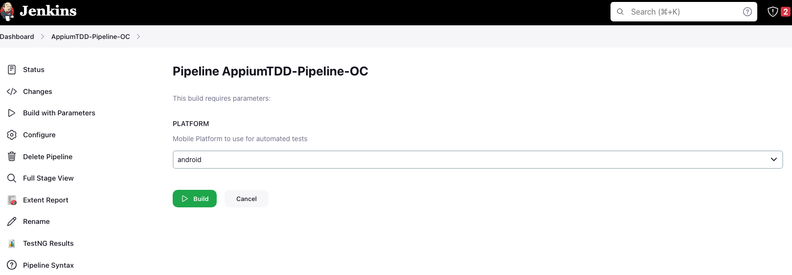

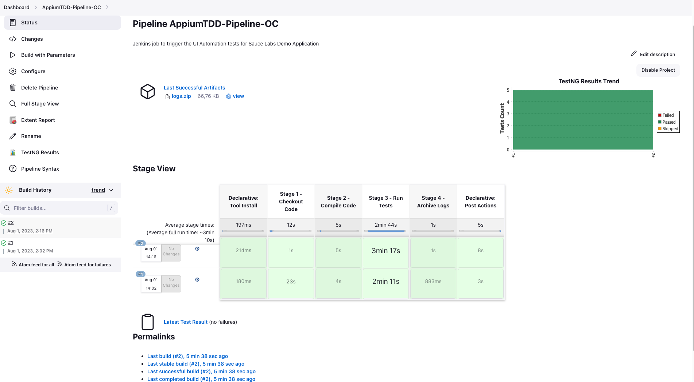

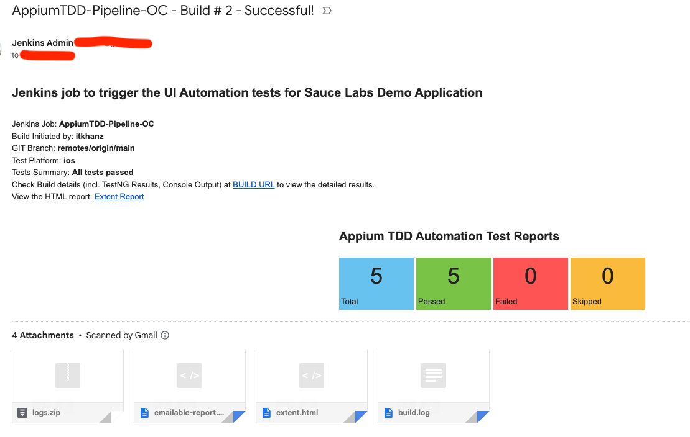
