# Appium TDD Framework

This repo contains the source code for Appium Java TDD Framework designed during the Udemy course of Omparkash Chavan

* [Link to Course](https://www.udemy.com/course/the-complete-appium-course-for-ios-and-android/)

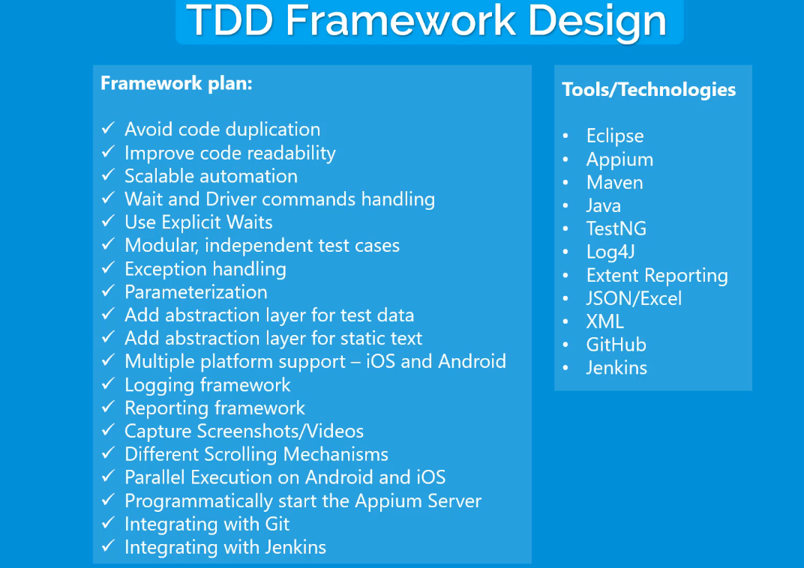

--

## Libraries and Tools

* Maven 3.9.2
* JDK 17.0.2
* TestNG 7.8.0
* Appium Java client 8.5.1
* Appium server 2.0
    * drivers
        * uiautomator2@2.29.2
        * xcuitest@4.32.19
* Appium inspector 2023.5.2
* Maven surefire plugin 3.1.2
* Demo Apps
    * [Sauce Labs Native Sample Application](https://github.com/saucelabs/sample-app-mobile)
* IntelliJ IDE

--

## Pre-requisites

* Install Maven
* Install Appium 2.0
* Install uiautomator2, xcuitest drivers
* Install Android Studio and setup Emulator
* Install XCode and setup Simulator (only for MAC)
* Configure Path variables as per your OS
* Verify the setup with appium-doctor
* Configure global properties in config.properties in src/test/resources
* configure device specific parameters in testng.xml
* Run tests with testng.xml

--

## Course Notes

Following sections summarize the important notes taken during the framework development.

### Part 1 - Automate Test Cases using TestNG and go through Bad Practices

* Appium Java Client will also download the Selenium Libraries as dependent libraries.

> Important! Please create all packages and class files in src/test/java and not in src/main/java. Recently, Appium has
> changed ths scope of one of its transitive Selenium dependency (Support UI package) from "compile" to "runtime". Due
> to
> this, the dependency may not resolve under src/main/java. We can certainly try to change the scope to compile, but
> lets
> be safe and create everything under src/test/java. This is where typically test automation resides. if you still want
> to
> use src/main/java, then please add the entire "selenium-java" package as a separate dependency in pom.xml. make sure
> to
> match the version with the selenium version that is shipped with the Appium Java client.

> For iOS real devices, remember you cannot use the IPA from the download location of application directly. You will
> need to get the source code, then go through the code signing process to generate the IPA. You can follow the iOS real
> device setup videos for the code signing process.

> if you get an error "com.swaglabsmobileapp.SplashActivity' or '
> com.swaglabsmobileapp.com.swaglabsmobileapp.SplashActivity' never started"  then you need to wait for the activity to
> start and add the appWaitActivity com.swaglabsmobileapp.MainActivity in capabilities.

[Error: Cannot start the 'com.swaglabsmobileapp' application. #79](https://github.com/saucelabs/sample-app-mobile/issues/79)

* Code Duplication:
    * Username and password steps are being repeatedly used in each test case.
    * Distribute the element definition globally and reuse in each test case.
* Readability:
    * code for performing login is not readable.
* Hardcoding - Test Data
    * username and password are being hardcoded in the test cases.
    * We should add abstraction between the test data and the code.
    * So change of test data will not impact test cases, and multiple tests can be ran from using same test data.
* Hardcoding - Static text
    * The error messages and hard coded which should also be abstracted away and read from external JSON/XML file.
* Scalability Issue
    * Driver initialization is confined to only single class, and cannot be reused.
    * Moreover, the capabilities should also be read from external file or through commandline.
* Waits
    * Implicit wait is not a good practice.
    * Use explicit wait and manage all the waits from single place.
* Multiple platform support
    * Test cases should be designed to support both iOS and Android platforms with minor changes.
    * Driver should be initialized for the corresponding platform based on test cases.
* Logging
    * Logging framework should be used instead of printing information on console.
    * In case of parallel execution, separate logs for each device should be used.
* Reporting
    * Reporting libraries should be used to create visually appealing report with screenshots and videos
* Exception Handling
    * Exceptions should be handled and printed to logs
* Configuration
    * Appium server urls and ports should be derived from config properties files

* Design the framework to achieve scalability, maintainability, abstraction, parameterization, robust logging and
  reporting,

### Part 2 - Implement Page Object Model (POM) design

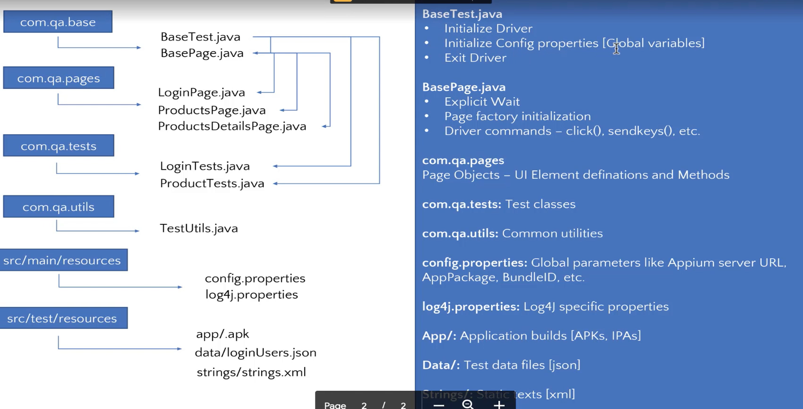

* Page Classes are added and extended from the BaseTest to reuse the methods and specify locators inside page classes.
* We achieved following objectives so far:
    * Avoid code duplication by reusing the elements.
    * Improve code readability by adding actions methods for login in page.
    * Scalable Automation by initializing the driver at BaseTest.
    * Wait and Driver commands handling at single place i.e. BaseTest super class
    * Modular and Independent test cases
    * Parameterization of global properties through config.properties and testng parameters for device.
        * All the parameters defined at test level will also be available to nested classes and methods in testng.xml
        * If the parameters are provided at test level and driver is initialized at class level, it will work for
          sequential execution.
        * But if you run the test classes in parallel, then it will try to install the same application parallel to all
          the test classes because we are providing the same parameters to all the test classes.
        *

* Inheritance approach has some disadvantages like one can create methods in child classes which will override the
  methods in
  parent class, or declare the elements inside Test Class instead of Pages which is not a good practice.
*

### Part 3 - Alternate Design | Abstract Test Data & Static Text | Exception Handling
* This lecture will discuss:

#### Alternate Design (no Inheritance)
    
* Go to the git branch `part3/alternate-design` to see the source code for this part.
* This time we initialize the driver in test class itself with @BeforeClass annotated method which means that driver
  will be initialized separately for each of the test class.
* This is fine for sequential execution, but not for parallel runs because of the thread conflicts and also the same app
  cannot be installed on same device for each class simultaneously. For this, we need multiple devices.

#### Exception Handling (Try/Catch, TestNG Listener)

* This TestListener which implements ITestListener will print the entire stacktrace to console and also to the testng results if error occurs:
* This way we do not have to use try-catch block for each step and use it in a generic manner to catch all the  exceptions.
```java
    @Override
    public void onTestFailure(ITestResult result) {
        //This will help to get the error stack trace to testng results to read the error cause
        //Check if there is an exception thrown by test result
        if (result.getThrowable() != null) {
            StringWriter sw = new StringWriter();
            PrintWriter pw = new PrintWriter(sw);
            result.getThrowable().printStackTrace(pw);  //prints the entire stacktrace to testng results
            System.out.println(sw.toString());  //prints the stacktrace to console
        }
    }
```

#### Add Abstraction Layer for Test Data

* We will use the `json` library from `org.json` to parse the Json for login user data.
* [JSON In Java » 20230618](https://mvnrepository.com/artifact/org.json/json/20230618)

```java
    try {
        loginDetails = getClass().getClassLoader().getResourceAsStream("data/loginUsers.json");
        JSONTokener tokener = new JSONTokener(loginDetails);
        loginUsersObject = new JSONObject(tokener);

        if (loginDetails != null) {
            loginDetails.close();
        }
    } catch (Exception e) {
        e.printStackTrace();
        System.out.println("Failed to load the test user data from " + Constants.dataFileName);
    }
```

* and then simply read the desired data e.g. 
* `loginUsersObject.getJSONObject("invalidUser").getString("username")`

#### Add Abstraction Layer for Static Text

* We place the strings in `strings.xml` file. Normally we get this file from android developers who also use the
  Strings.xml for storing strings, this way we do not have to create them separately for automation.

```xml
<?xml version="1.0" encoding="utf-8"?>
<resources>
    <!-- Error Text -->
    <string name="err_invalid_username_or_password">Username and password do not match any user in this service.</string>
    <string name="product_title">PRODUCTS</string>
</resources>
```
* We will use the `DocumentBuilderFactory` to read the xml.
```java
public HashMap<String, String> parseStringXML(InputStream file) throws Exception{
        HashMap<String, String> stringMap = new HashMap<String, String>();
        //Get Document Builder
        DocumentBuilderFactory factory = DocumentBuilderFactory.newInstance();
        DocumentBuilder builder = factory.newDocumentBuilder();

        //Build Document
        Document document = builder.parse(file);

        //Normalize the XML Structure; It's just too important !!
        document.getDocumentElement().normalize();

        //Here comes the root node
        Element root = document.getDocumentElement();

        //Get all elements
        NodeList nList = document.getElementsByTagName("string");

        for (int temp = 0; temp < nList.getLength(); temp++)
        {
            Node node = nList.item(temp);
            if (node.getNodeType() == Node.ELEMENT_NODE)
            {
                Element eElement = (Element) node;
                // Store each element key value in map
                stringMap.put(eElement.getAttribute("name"), eElement.getTextContent());
            }
        }
        return stringMap;
    }
```
* And then we can simply read it by parsing the XML stream as InputStream and storing it into HashMap.

### Part 4 - Support iOS Platform

* Appium provides a common API to test both iOS and Android platforms.
* Download the .zip file for application to run on iPhone Simulator. Please note that .ipa file is for real device and
  not for simulators, plus you need paid apple developers account and complete the code signing process to install the
  app on real device.
* Add the iOS driver initialization with switch statement.
* Add the UI element locators for iOS
* add the test for iOS in testng.xml
* For iOS, the text attribute is not present, instead there is a label attribute. Therefore we created separate methods
  for getting text and label in BaseTest class itself, so we can reuse them.
* If the keyboard is not opening on simulator, then go to Hardware -> Keyboard -> Connect Hardware Keyboard option in Simulator and uncheck it.

#### speed-up iOS Tests

* It took long time for test executions on the iOS. I also experienced it.
* This is probably because the Appium builds the WebDriverAgent server for your iOS simulator which consumes a lot of time and may some times fails.
* If you have already run the appium tests once on simulator so it probably has WDA already installed on it. In this case, you can use the capability

`"appium:usePrebuiltWDA": true
`
This will result in Appium using the prebuilt WDA and the test execution will speedup.

* On further runs, Appium Server may also use the prebuilt WDA from cache, but i am not sure in which cases it uses WDA from cache.
* You can also manually install the WDA agent on iOS by running the command in your terminal:

`xcodebuild build-for-testing test-without-building -project <PATH-TO-XCODE-WDA-AGENT> -scheme WebDriverAgentRunner -destination id=<SIMULATOR-UDID> IPHONEOS_DEPLOYMENT_TARGET=<IOS-VERSION> GCC_TREAT_WARNINGS_AS_ERRORS=0 COMPILER_INDEX_STORE_ENABLE=NO
`
* replace the values as per your system environment and desired simulator e.g.
* the path to WDA agent will be like `/Users/xxxx/.appium/node_modules/appium-xcuitest-driver/node_modules/appium-webdriveragent/WebDriverAgent.xcodeproj`
* UDID and iOS Version  can be found by running `xcrun simctl list` in terminal
* it will take some time, afterwards show the ** TEST BUILD SUCCEEDED ** in terminal, so after this you can close the terminal and execute the tests with prebuilt WDA.
* Additionally, you can also provide additional capabilities of webDriverAgentUrl and derivedDataPath to further speed up the tests.


### Part 5 - Add more test cases | Define common elements | Write independent tests

* We add two more test cases for verifying the title and price of `Sauce labs Backpack` item on ProductsPage and ProductDetailsPage.
* Before we execute any test methods, the app state must be reset i.e. the app must be at the login page at test start.
* For this purpose, we add the two utility methods in BaseTest.
```java
    public void closeApp() {
        switch (platform) {
            case "Android" -> ((InteractsWithApps) driver).terminateApp(props.getProperty("androidAppPackage"));
            case "iOS" -> ((InteractsWithApps) driver).terminateApp(props.getProperty("iOSBundleId"));
        }
    }

    public void launchApp() {
        switch (platform) {
            case "Android" -> ((InteractsWithApps) driver).activateApp(props.getProperty("androidAppPackage"));
            case "iOS" -> ((InteractsWithApps) driver).activateApp(props.getProperty("iOSBundleId"));
        }
    }
```
* To make test methods independent, we put it in the @BeforeMethod and @AfterMethod of our test classes.

#### Define Common Elements

* We will also see how to define UI elements which are common across pages.
* The top bar of the app containing hamburger icon, logo, and cart is common to all the pages.
* Also, the sidebar after clicking the menu settings icon is also common to all the pages.
* Create Pages for MenuPage and SettingsPage.
> If the element is not located by Appium Inspector, then try to locate it by expanding XML.
* We extend the ProductsPage to MenuPage and then ManuPage to BaseTest, since MenuPage is common to many pages such as ProductsPage, ProductsDetailsPage.

#### Failure recovery / Fail safe test cases
* Added print statements to all the methods in order to have logging for debugging.
* In case a test fails, we need to make sure that the next test does no get impacted and starts with the clean app state.
* Currently, the tests for ProductTest class are not completely independent because if the if the first test case fails
  for some reason then this will not bring the application to clean state, so the second test will not start from the
  fresh state.
* To make the test cases completely independent of failures, we can handle the login and logout in @BeforeMethod and @AfterMethod


### Scrolling - UIAutomator2 | Mobile Scroll

#### Android Scroll

* To verify the product price on ProductDetailsPage, we need to implement scrolling mechanism.
* [UiScrollable](https://developer.android.com/reference/androidx/test/uiautomator/UiScrollable)
* UiScrollable and UiSelector are part of the UiAutomator native android driver.
* Appium provides API to perform scrolling through UiAutomator2 driver.
* The disadvantage of this approach is that the syntax for this action will only be checked during run-time.

```java
    private WebElement SLBPrice() {
        return driver.findElement(AppiumBy.androidUIAutomator(
                "new UiScrollable(new UiSelector()" + ".scrollable(true)).scrollIntoView("
                        + "new UiSelector().description(\"test-Price\"));"));
    }
```
> UiScrollable does not support single quite for nested commas, instead always use double quotes with escape character.

> If there is only one scrollable element on the page, then you dont have to find the parent scrollable element and you can just use .scrollable(true)  

#### iOS Scroll

* [mobile: scroll](https://appium.github.io/appium-xcuitest-driver/4.32/execute-methods/#mobile-scroll)
```java
    private void iOSScrollToSLBPrice() {
        String elementID = ((RemoteWebElement)SLBPrice).getId();
        HashMap<String, Object> scrollMap = new HashMap<>();
        scrollMap.put("element", elementID);
        scrollMap.put("toVisible", true);
        driver.executeScript("mobile: scroll", scrollMap);
    }
```
* [mobile: scrollToElement](https://appium.github.io/appium-xcuitest-driver/4.32/execute-methods/#mobile-scrolltoelement)
```java
    private void iOSScrollToSLBPrice() {
        String elementID = ((RemoteWebElement)SLBPrice).getId();
        HashMap<String, Object> scrollMap = new HashMap<>();
        scrollMap.put("element", elementID);
        driver.executeScript("mobile: scrollToElement", scrollMap);
    }
```

### Capture Screenshots

#### Capture screenshot for failed test case using TestNG listener.
* Copy screenshot by creating below folder structure:
  * `\Screenshots`
  * `\<platformName>_<platformVersion>_<deviceName>` (facilitates screenshot capturing in case of parallel execution)
  * `\<dateTime - yyy-MM-dd-HH-mm-ss>` (Ensures sceenshot are not overwritten - can also use build number CI/CD)
  * `\<testClass>` (lists all methods as per test classes)
  * `\<methodName.png>` (helps identify the failed method)
* This folder structure will ensure that the screenshots will not get overwritten

```java
        //Screenshot capture and save to formatted imagePath
        Map<String, String> testParams = new HashMap<String, String>();
        testParams = result.getTestContext().getCurrentXmlTest().getAllParameters();

        String imagePath =  "screenshots" + File.separator
                            + TestUtils.getFormattedDateTime() + File.separator
                            + testParams.get("platformName") + "_" + testParams.get("deviceName") + File.separator
                            + result.getTestClass().getRealClass().getSimpleName() + File.separator
                            + result.getName() + ".png";

        BaseTest base = new BaseTest();
        File file = base.getDriver().getScreenshotAs(OutputType.FILE);
        try {
            FileUtils.copyFile(file, new File(imagePath));
        } catch (IOException e) {
            e.printStackTrace();
            System.out.println("Failed to save the screenshot");
        }
```

* screenshot folder will look like this: 

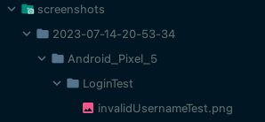

#### Add screenshot to TestNG report HTML

> By default, IntelliJ does not generate test-output folder, and so you cannot view the TestNG HTML report.
* To get it in IntelliJ, you have to do a small change in settings.
  * At the top select the dropdown and click on edit configuration
  * Check on Use default reporters which is under listener tab option which will create test-output folder in your root
    folder with all reports.

* [How can I include a failure screenshot to the testNG report](https://stackoverflow.com/a/8970314/7673215)
* You can call your screenshot grabbing method and use `Reporter.log` to put the hyperlink to that screenshot. Then you
  can find this link under the failed testcases details.
```java
    Reporter.log("<a href='"+ destFile.getAbsolutePath() + "'>  </a>");
```

> IntelliJ shows broken image in the browser. For previewing the report with image, view it by opening it in browser
  from system instead of from Intellij server.


### Record Videos

* You have two options to record videos.
* First option is to start and stop the recording in TestNG listener:
  * Start the recording in `onTestStart` method
  * Stop the recording in both `onTestFailure` and `onTestSuccess` because there is no single method provided by the
    test listener to check the test finish on both success and failure.
* Other option is  to start and stop the recording at Test Classes in `@BeforeMethod` `@AfterMethod` methods.
  * The problem with this approach is in case of multiple test classes, then we will have to implement it in all of the
    test classes which causes code duplication.
  * Solution is to create the `@BeforeMethod` `@AfterMethod` methods in parent class BaseTest which means that the
    TestNG will first execute the methods in parent class and then in child. so we can write the code for video
    recording at super class level.
* [Start Recording Screen](https://appium.readthedocs.io/en/latest/en/commands/device/recording-screen/start-recording-screen/)
* [Apache Commons Codec](https://mvnrepository.com/artifact/commons-codec/commons-codec/1.16.0) library is used to decode the base64 string to byte[]
* You can also choose to save the video recording in case of failed only test cases with `result.getStatus()` method. 
* This returns the status as success = 1, failure = 2, skip = 3
* For iOS we need to install ffmpeg library for recordings
* `brew install ffmpeg`
> if mp4 videos are not played by default, then you can specify another non-default codec. Both mpeg4 and libx264 work fine.

`((CanRecordScreen) driver).startRecordingScreen(IOSStartScreenRecordingOptions.startScreenRecordingOptions().withVideoType("mpeg4"));
`

### Parallel Execution using Real Android and iOS devices

* Following things have to be considered for parallel execution:
  * Server side changes
  * Client side changes
  * Thread safe automation changes
  * Different level of parallel execution
  * logging with parallel execution
  * Appium and TestNG bugs
  * Atomic tests - each test case should run independently

* [Parallel tests documentation](https://appium.readthedocs.io/en/stable/en/advanced-concepts/parallel-tests/)
* [Appium Parallel Execution Docs](https://github.com/appium/appium/blob/1.x/docs/en/advanced-concepts/parallel-tests.md)
* [Automating hybrid apps](https://appium.readthedocs.io/en/stable/en/writing-running-appium/web/hybrid/)
  * `webkitDebugProxyPort` capability and `ios-webkit-debug-proxy` is not required as of latest appium 2.0.
  * When executing against an iOS real device, Appium is unable to access the web view directly. Therefore the connection
    has to be established through the USB cable.Appium can establish the connection natively since version 1.15
    via [appium-ios-device](https://github.com/appium/appium-ios-device
  * Before you can run your tests against Safari on a real device you will need to:
    * Turn on web inspector on iOS device (settings > safari > advanced)
  * https://github.com/appium/appium/issues/16486
  * https://github.com/appium/appium/issues/16494
  * https://github.com/appium/appium/pull/16824

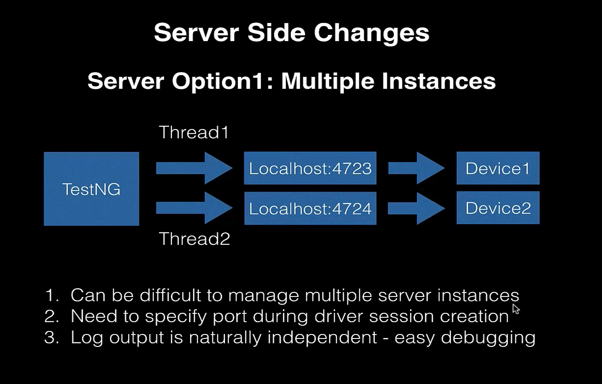

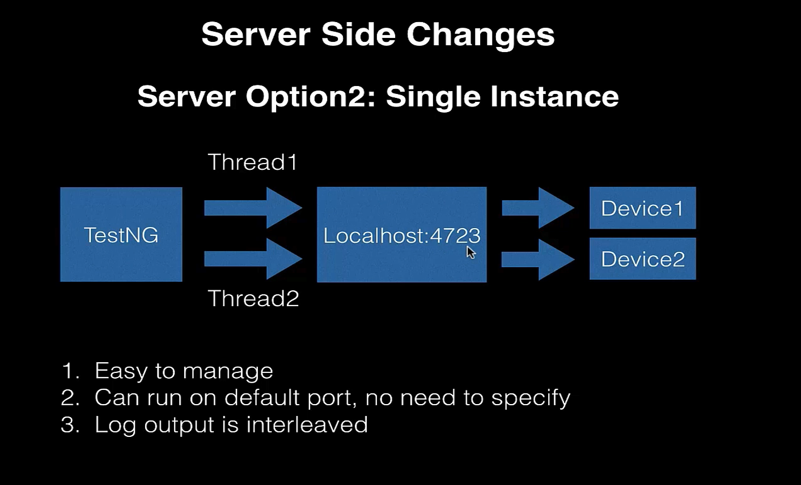

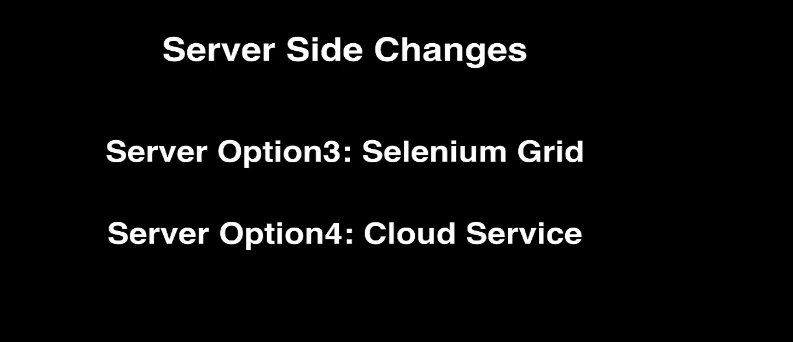

* For the purpose of this framework, option 1 and 2 will be implemented.

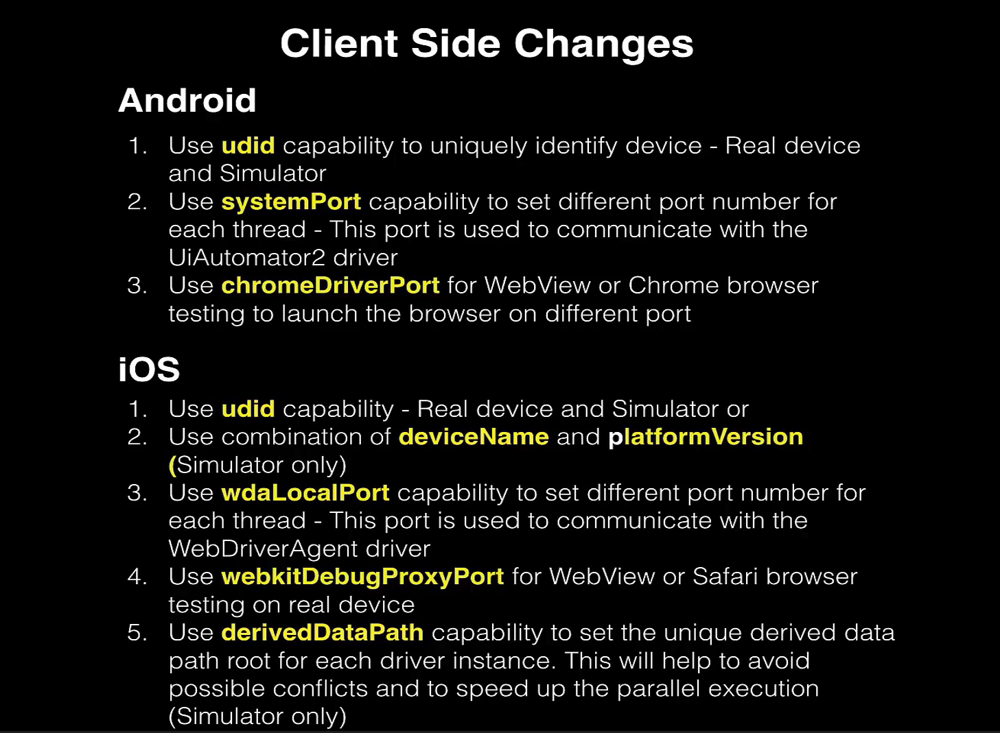

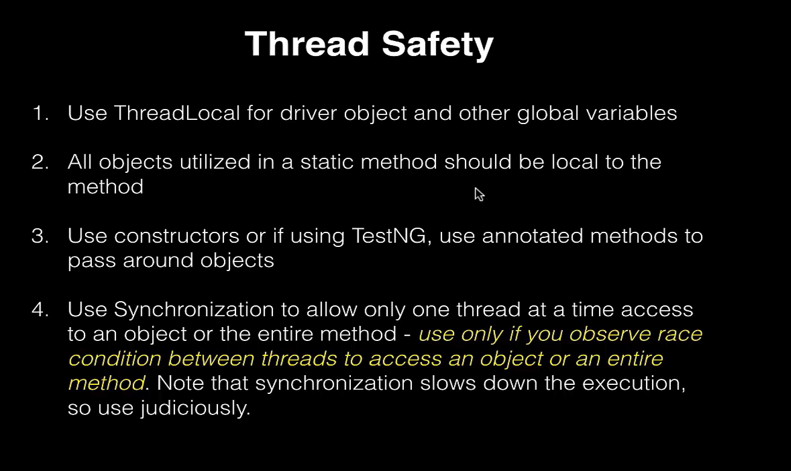

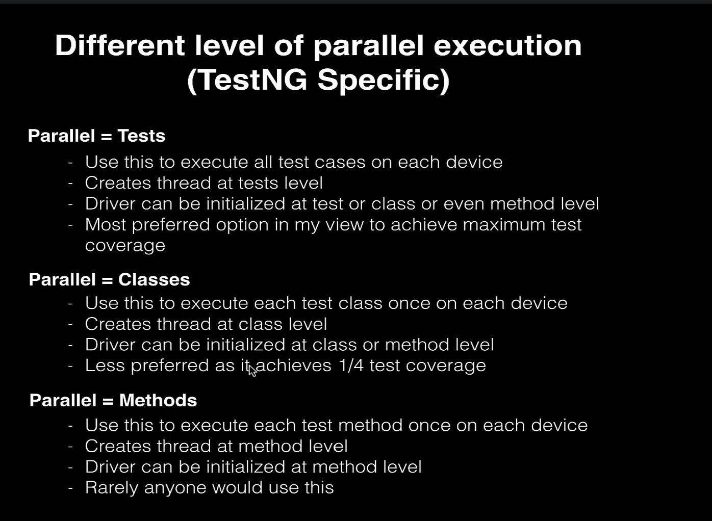

* Different level of parallel execution.
  * In case of web automation, setting parallel execution at method level is way to go, but for mobile automation parallel execution at test level is the preffered way.
  * Therefore we will choose the parallel execution at test level.

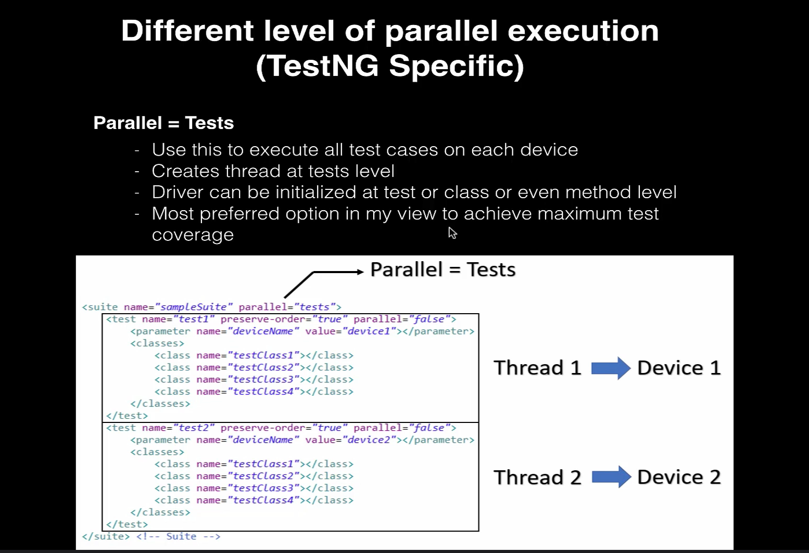

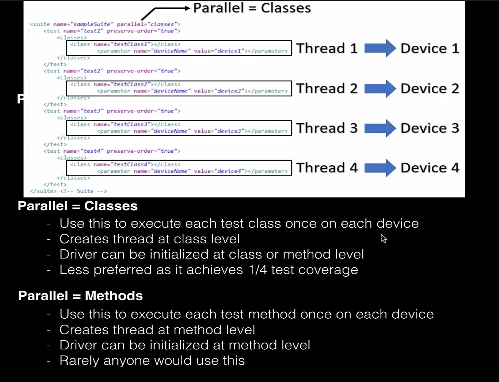

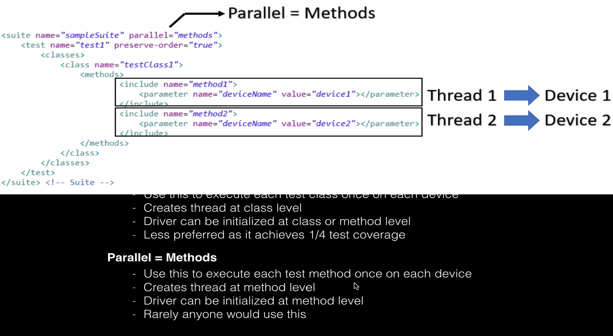

* Logging mechanism

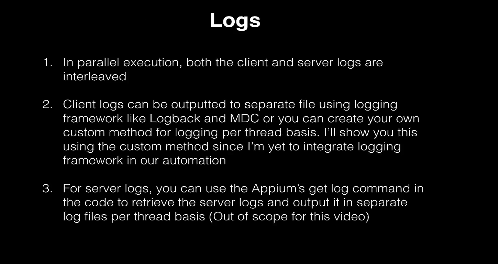

* Now we will make the desired changes to framework that will support parallel execution for upto 4 devices:

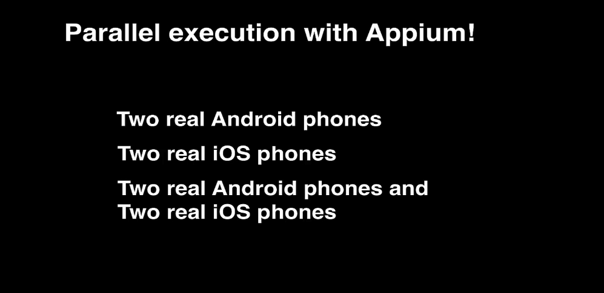

* First we change the class level global variables to ThreadLocal
* No we need to remove class level references to global variables, and instead use getters and setters.
* In case of race-condition between two threads, we can apply synchronization provided by Java to sync either the full method or object.
* We also need to move class level objects to methods
* We also need to add the capability for each of the platforms and change testng.xml
* Start the 2 instances of appium server on different ports:
  * appium -p 4723 --use-drivers=uiautomator2
  * appium -p 4724 --use-drivers=xcuitest
* Now we can run the tests in parallel on both android and ios

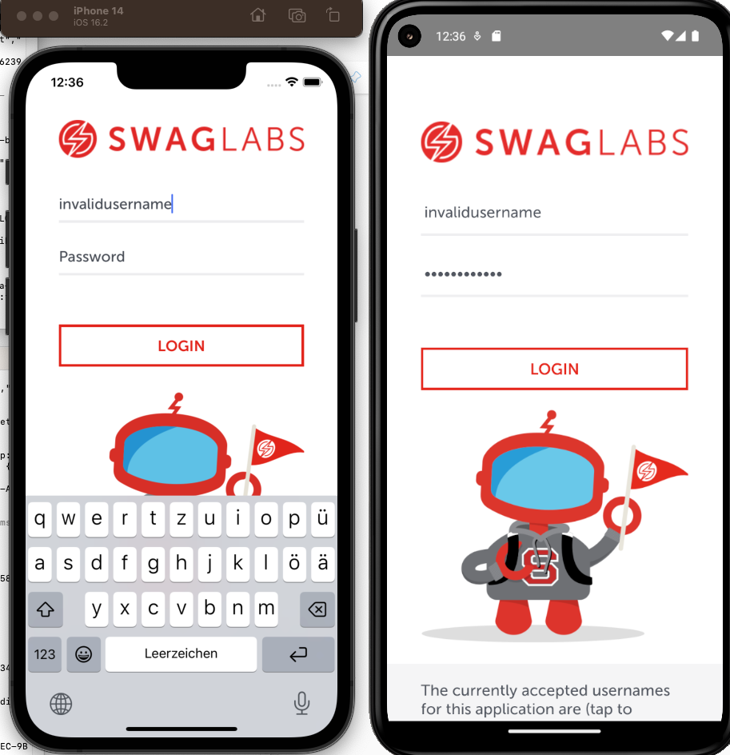


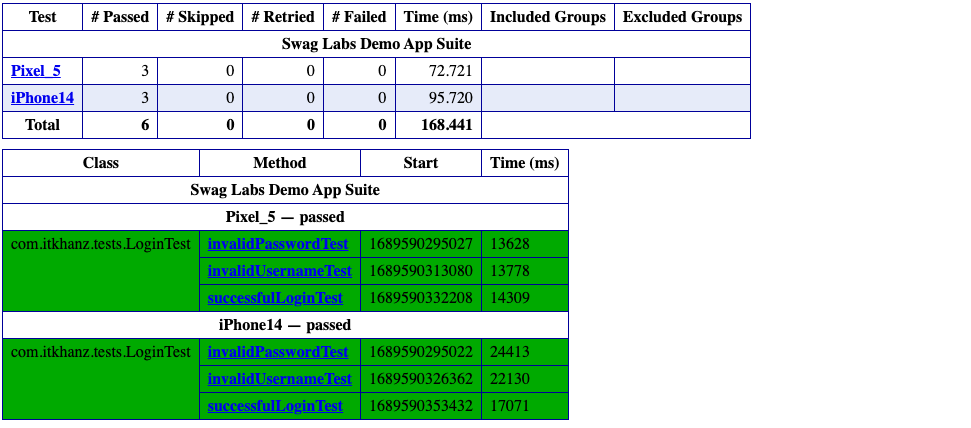

* The problem with the current setup is that logs foe both the tests are interlinked and we cannot determine which logs are for which device.
* We will implement a custom method which outputs the log for each device to separate file.
```java
    public void log(String txt) {
        BaseTest base = new BaseTest();
        String msg = Thread.currentThread().getId() + ":" + base.getPlatform() + ":" + base.getDevice() + ":"
                + Thread.currentThread().getStackTrace()[2].getClassName() + ":" + txt;

        System.out.println(msg);

        String strFile = "logs" + File.separator + base.getPlatform() + "_" + base.getDevice()
                + File.separator + base.getDateTime();

        File logFile = new File(strFile);

        if (!logFile.exists()) {
            logFile.mkdirs();
        }

        FileWriter fileWriter = null;
        try {
            fileWriter = new FileWriter(logFile + File.separator + "log.txt",true);
        } catch (IOException e) {
            e.printStackTrace();
        }
        PrintWriter printWriter = new PrintWriter(fileWriter);
        printWriter.println(msg);
        printWriter.close();
    }
```

* We will replace `System.out.println()` statements with our custom log method.
* Now we will use single appium server to run tests in parallel on 1 android and 1 iOS device.
  * `appium --use-drivers=xcuitest,uiautomator2 -p 4723`
* Now we can see that the logs for each device are written separately

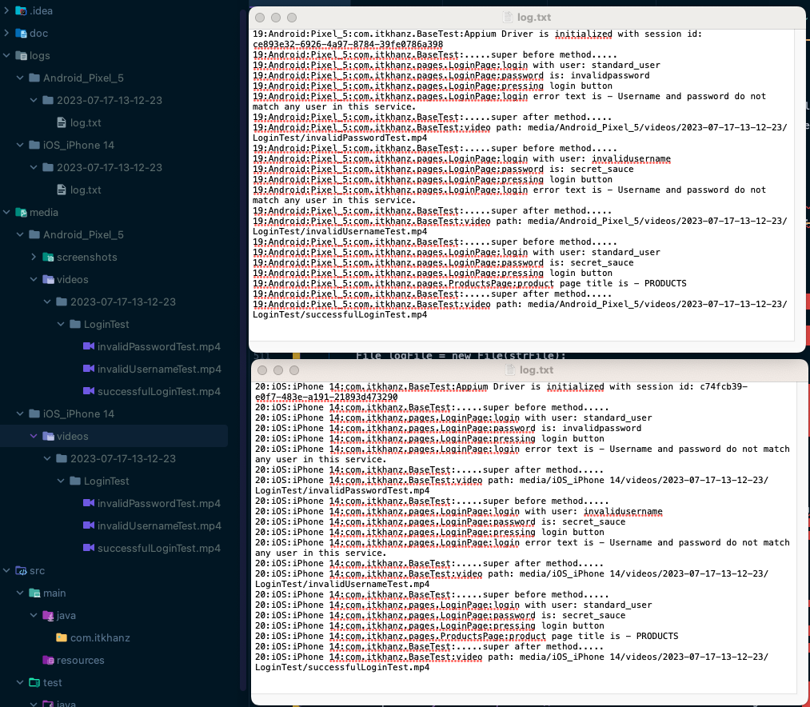


### Log4j2 Logging framework integration

### Log4j2 - Logging in multi-threaded environment (parallel execution)

### Start Appium server programmatically

### Extent Reports integration
